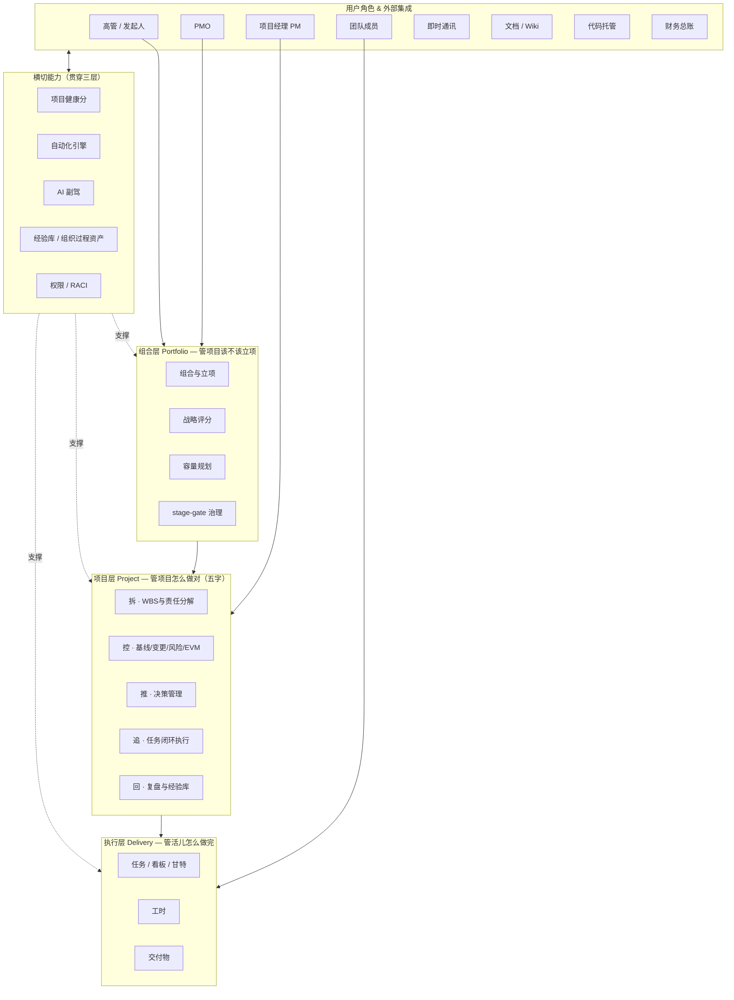
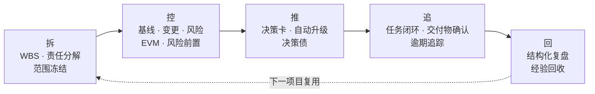
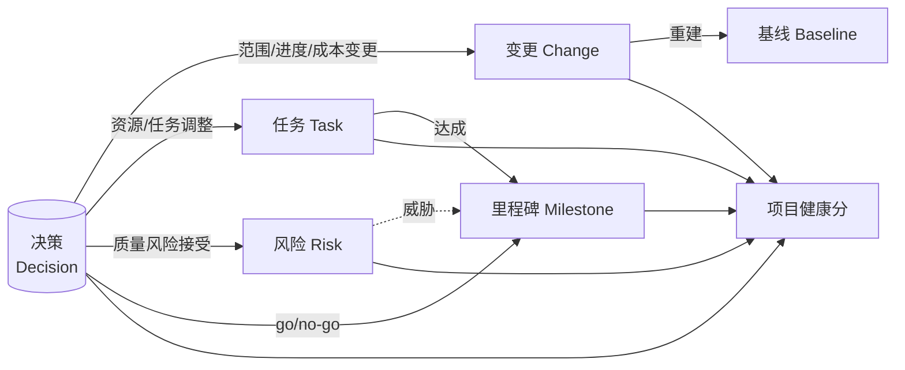
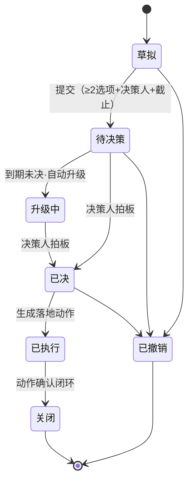
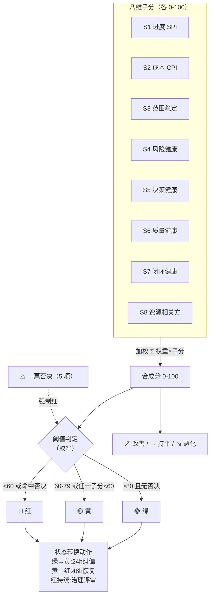

# 07 · 产品架构图

> 全部为业务架构（不含技术实现），用 Mermaid 绘制，可在 Markdown 渲染器中直接查看。
> 阅读顺序：先看图 1 总体架构，再按 图2（五字驱动）→ 图3（对象枢纽）→ 图4（决策状态机）→ 图5（健康分构成）逐层深入。

---

## 图 1 · 总体产品架构（三层 + 横切）

价值链自上而下：用户驱动 → 组合层（该不该做）→ 项目层（怎么做对）→ 执行层（怎么做完）。横切能力贯穿三层，支撑而非打断主链。

**读图要点**
- **集成而非自建**：IM/文档/代码/财务只接入、不自造（Ponytail 原则：少即是多）。
- **横切层**：健康分、自动化引擎、AI 副驾、经验库、权限——这三层都要用，所以放在侧面贯穿，而不是塞进某一层。

---

## 图 2 · 五字驱动流（拆 → 控 → 推 → 追 → 回）

五个动作不是孤立的，而是一条贯穿项目始终的驱动链，且「回」的产物喂回下一个项目的「拆」——形成组织级的能力闭环。

**读图要点**：闭环的箭头是「经验库」的具象——本项目的复盘结论（模板/清单/规则/预警项）成为下一个项目「拆」的起点，这正是「回」的核心价值。

---

## 图 3 · 核心对象枢纽模型（决策是一等公民）

决策不是孤立记录，而是项目的**枢纽**：一次决策会同时派生出变更、任务、风险；而所有对象的状态又汇聚成项目健康分。

**读图要点**
- 决策居中、向外发散——一次拍板，四处响应（变更/任务/风险/里程碑）。
- 健康分在右下角汇聚所有对象——它是「结果指标」，对象状态是「因」。

---

## 图 4 · 决策生命周期状态机

决策有严格的状态流转，「已决」不是终点，必须「已执行」并确认闭环才能「关闭」。

**读图要点**：实线「待决策→已决→已执行→关闭」是主路径；「升级中」是到期未决的自动分支；「已撤销」是从多数状态可达的终态，但审计记录保留。

---

## 图 5 · 项目健康分构成逻辑

八维子分加权合成 → 阈值判定出红黄绿；同时一票否决可强行覆盖为红；分数变化触发对应的状态转换动作。

**读图要点**
- 双轨：「合成分」管总体，「一票否决」管致命单点，**两者取严**（一个 85 分但关键路径在塌的项目仍是红）。
- 「阈值判定」向下驱动「状态转换动作」——灯不是摆设，每次变色触发强制流程，闭环接回「推/追」。

---

## 图间关系小结

| 图 | 回答的问题 |
|----|-----------|
| 图 1 总体架构 | 系统分几层？谁在用？哪些是自建、哪些靠集成？ |
| 图 2 五字驱动 | 拆控推追回怎么串起来、怎么循环？ |
| 图 3 对象枢纽 | 决策、任务、风险、变更、健康分之间什么关系？ |
| 图 4 决策状态机 | 一个决策从生到死经历哪些状态？ |
| 图 5 健康分构成 | 一个项目怎么变成 0–100 的一个数和一盏灯？ |
