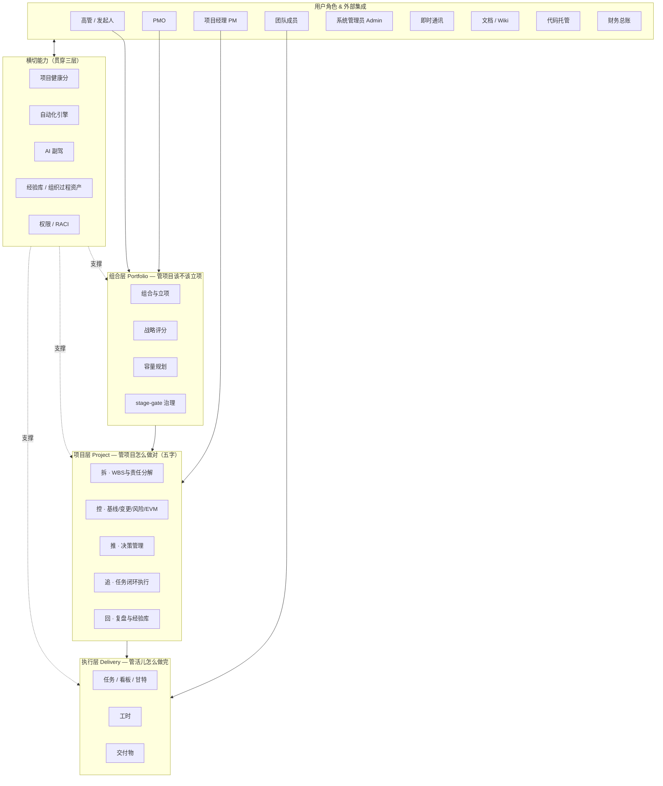
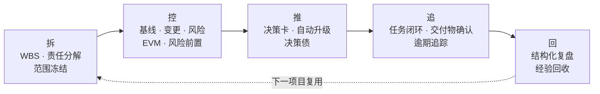
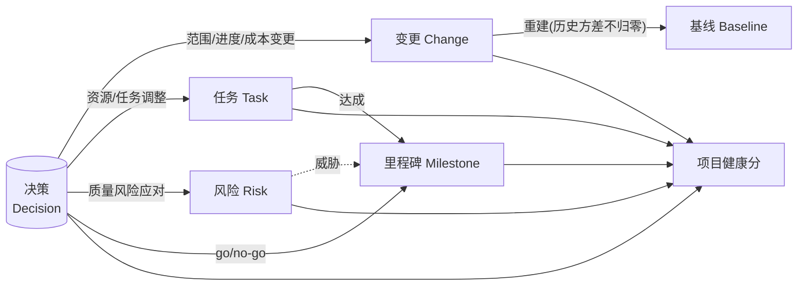
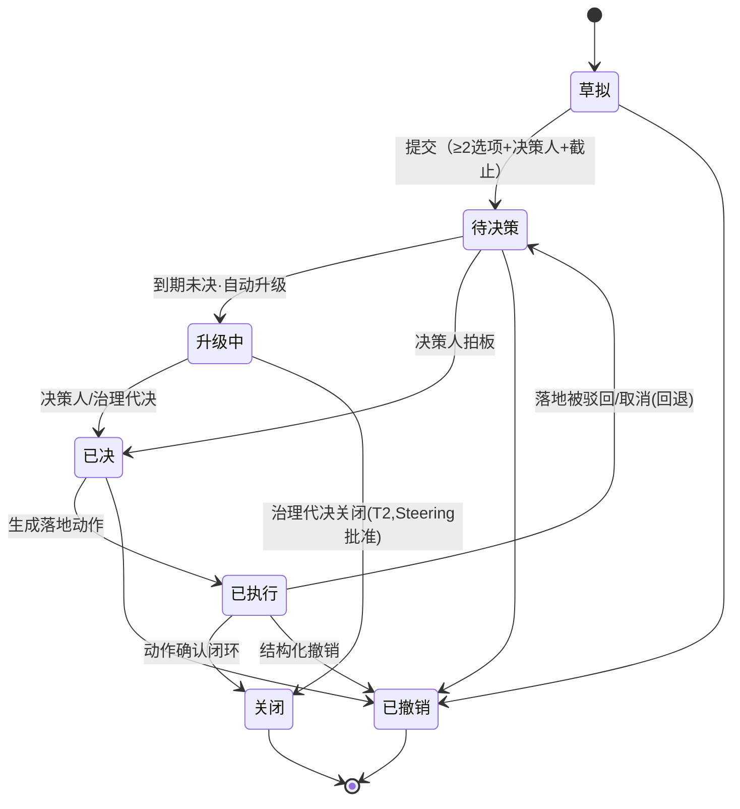
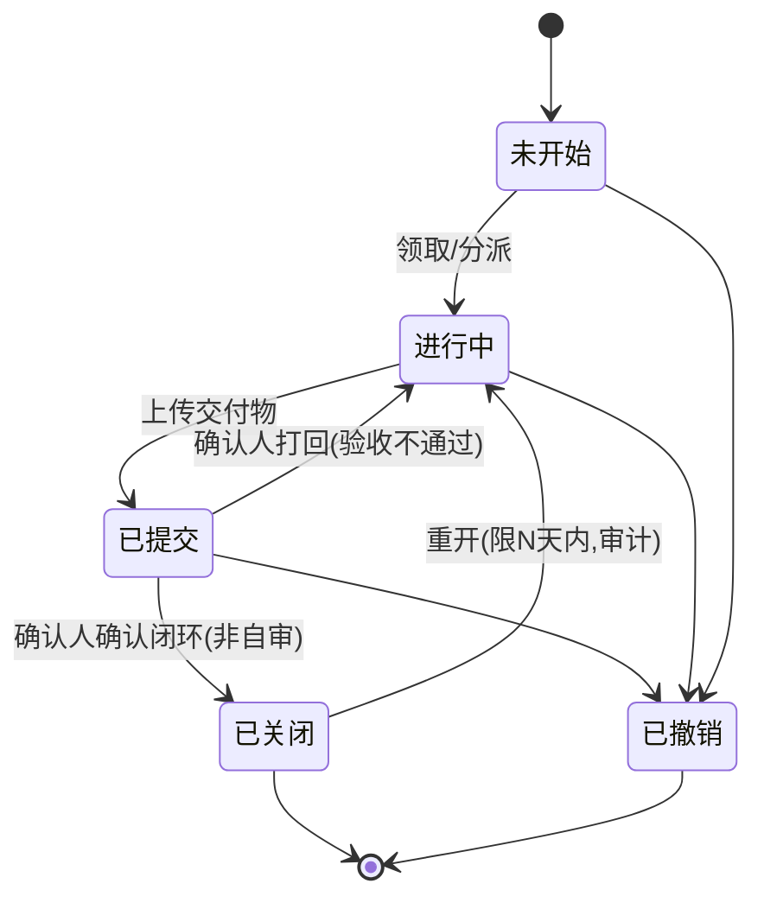
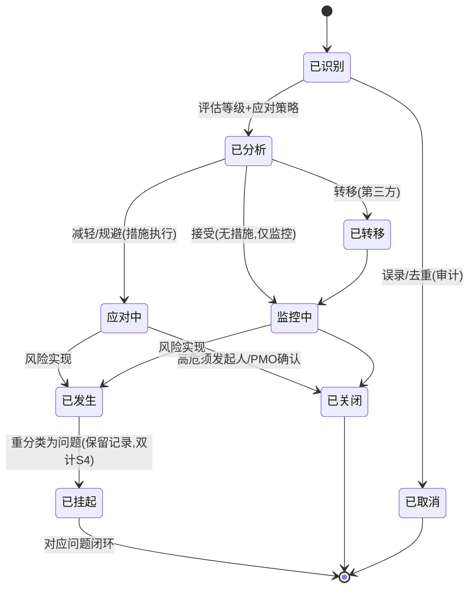
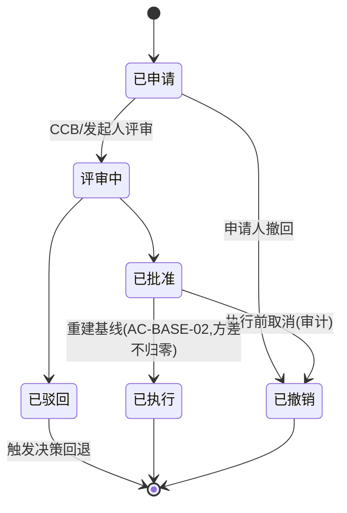
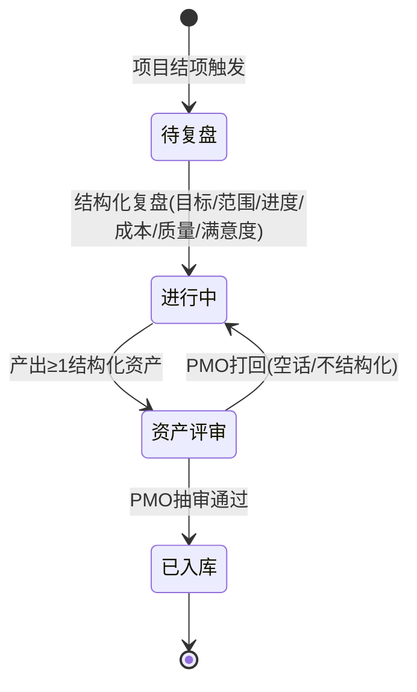
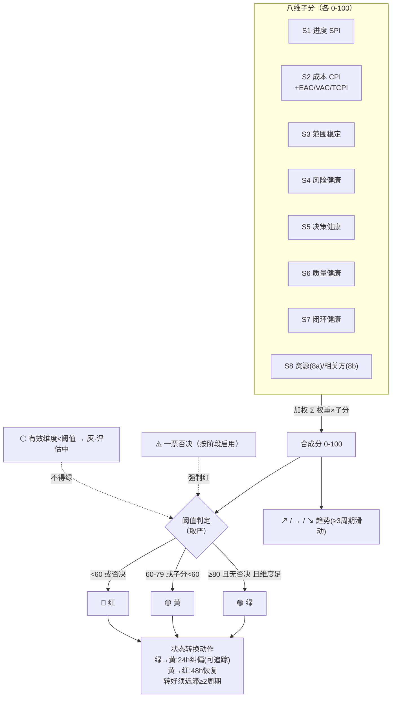
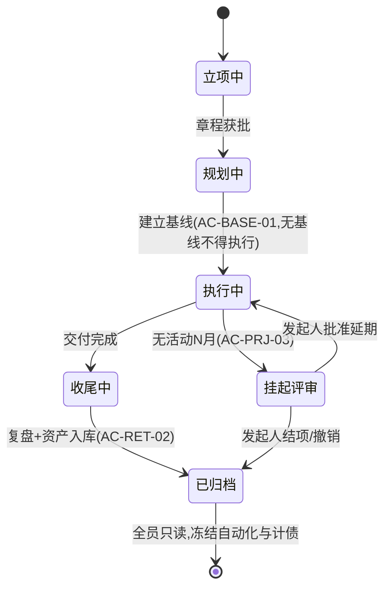

# 07 · 产品架构图

> 全部为业务架构（不含技术实现），用 Mermaid 绘制。阅读顺序：图1 总体架构 → 图2 五字驱动 → 图3 对象枢纽 → 图4–8 对象状态机 → 图9 健康分构成 → 图10 项目状态机。

---

## 图 1 · 总体产品架构（三层 + 横切）

价值链自上而下：用户驱动 → 组合层 → 项目层 → 执行层。横切能力贯穿三层。

**读图要点**
- **集成而非自建**：IM/文档/代码/财务只接入、不自造。
- **横切层**：健康分、自动化引擎、AI 副驾、经验库、权限——三层都用，放侧面贯穿。
- 角色全集（含 Admin、发起人、决策人、CCB、相关方）见 [docs/11](11-权责与访问范围设计.md)；图1 只列主操作角色。
- 三层架构（Portfolio/Project/Delivery）；**Program（项目集）层为 P2 扩展，届时升为四层**（见 docs/10 §4.12、docs/13 §七）。

---

## 图 2 · 五字驱动流（拆 → 控 → 推 → 追 → 回）

---

## 图 3 · 核心对象枢纽模型（决策是一等公民）

---

## 图 4 · 决策生命周期状态机（含回退弧）

**读图**：`已执行→待决策` 回退弧消除"落地失败死锁"；`升级中→关闭` 为 T2 超时后治理代决关闭（经 Steering 批准，AC-DM-13b）。

---

## 图 5 · 任务状态机

**读图**：`已提交`即"完成但未闭环"态——必须有交付物 + 独立确认才到 `已关闭`。

---

## 图 6 · 风险状态机

**读图**：按策略分叉（减轻/规避→应对中、接受→监控中、转移→已转移→监控中）；高危关闭须独立确认；`已发生`转`已挂起`（非终态），原记录保留并双计 S4，直到对应问题闭环才终态。

---

## 图 7 · 变更状态机

---

## 图 8 · 复盘状态机

**读图**：复盘必须产出**结构化资产**且 PMO 抽审通过才能结项（AC-RET-02），堵"自由文本废话"漏洞；资产评审有 SLA，超时升级/转审，防单点堵死结项。

---

## 图 9 · 项目健康分构成逻辑

**读图**：双轨（合分管总体 / 否决管致命单点）取严；缺数据显"灰"不得绿；转好有迟滞防抖动。

---

## 图 10 · 项目状态机

**读图**：项目级状态门——无基线不得"执行中"（AC-BASE-01）、无活动 N 月进"挂起评审"（AC-PRJ-03）、归档即冻结自动化与决策债计息。

---

## 图间关系小结

| 图 | 回答的问题 |
|----|-----------|
| 图 1 总体架构 | 分几层？谁在用？哪些自建/哪些集成？ |
| 图 2 五字驱动 | 拆控推追回怎么串、怎么循环？ |
| 图 3 对象枢纽 | 决策/任务/风险/变更/健康分什么关系？ |
| 图 4 决策状态机 | 一个决策从生到死（含回退）？ |
| 图 5 任务状态机 | 任务"完成"和"闭环"的区别？ |
| 图 6 风险状态机 | 风险识别到关闭/转问题？ |
| 图 7 变更状态机 | 变更申请到执行/驳回？ |
| 图 8 复盘状态机 | 复盘到资产入库？ |
| 图 9 健康分构成 | 项目怎么变成一个数和一盏灯？ |
| 图 10 项目状态机 | 项目从立项到归档的状态门？ |
