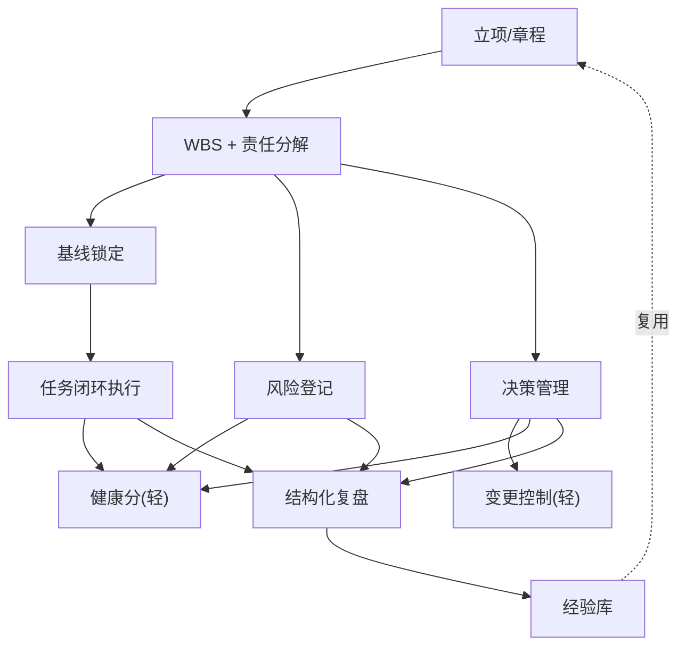
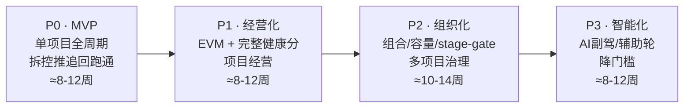

# 08 · MVP 模块优先级与建设路线

## 一、建设原则

1. **纵切优先**：先在一个真实项目上跑通「拆→控→推→追→回」全链路，再横向铺模块。不要先把 12 个模块各做一半。
2. **脊柱先行**：MVP 必须包含标志性机制（决策卡 + 自动升级、任务闭环确认、风险前置、结构化复盘）。**缺了这些，就退化成市面上又一个任务工具，证明不了任何差异化。**
3. **每阶段一个价值验证点**：做出来不算完，要能证明它解决了上一版定位里的某个真问题。
4. **市场标配快速做齐（专业底线），护城河重点投入**：WBS/EVM/基线是底线要齐；决策、健康分、复盘是刃要打磨。
5. **时间区间是粗略产品规划，非技术工期承诺**：实际取决于团队规模与技术选型。

---

## 二、模块优先级矩阵

| 模块 | 五字 | 优先级 | 理由 |
|------|:---:|:---:|------|
| 立项 / 项目章程 | 拆 | **P0** | 没有项目对象就没法开始 |
| WBS 与责任分解 | 拆 | **P0** | 脊柱起点；强制交付物/责任人/截止/验收 |
| 任务与闭环执行 | 追 | **P0** | 核心执行；「交付物+确认关闭」是标志 |
| 基线与变更控制 | 控 | **P0**(轻) / P1(完整 CCB) | 范围失控的刹车片；MVP 做轻版 |
| 风险与问题 | 控 | **P0** | 风险前置是「控」的核心 |
| 决策管理 | 推 | **P0** | 最独特资产，相对独立，尽快验证 |
| 自动化引擎 | 追 | **P0**(核心规则) / P1(自定义) | 决策升级/逾期提醒依赖它 |
| 结构化复盘 | 回 | **P0** | 「回」是脊柱收尾 |
| 项目健康分 | 全 | **P0**(轻) / P1(完整) | 门面；MVP 做轻版 |
| EVM（CPI/SPI） | 控 | P1 | 需成本/工时数据，MVP 后做 |
| 决策债可视化 | 推 | P1 | 增强决策模块 |
| 经验库跨项目复用 | 回 | P1 | 单项目复盘 P0，跨项目复用 P1 |
| 工时 / 资源 | 资源 | P1 | EVM 与容量的前置数据 |
| 变更控制完整（CCB） | 控 | P1 | MVP 轻版够用，治理版后置 |
| 组合管理（战略/容量/stage-gate） | 组合 | P2 | 多项目才需要 |
| 沟通 / 相关方矩阵 | 推 | P2 | MVP 通知并入自动化 |
| 依赖管理增强 | 追 | P2 | MVP 做基础依赖即可 |
| 仪表盘 / 报表 | 全 | P2 | MVP 内嵌基础视图 |
| AI 副驾 | 全 | P3 | 增强，非脊柱 |
| 辅助轮模式 | 全 | P3 | 新手降门槛 |
| pre-mortem 闸 / 风险剧本 | 控 | P3 | 高阶「控」 |

---

## 三、四阶段建设路线

| 阶段 | 目标 | 关键模块 | 价值验证点 | 粗略区间 |
|------|------|---------|----------|:---:|
| **P0 · MVP** | 单项目跑通拆控推追回全周期 | 立项/WBS、任务闭环、基线+变更(轻)、风险、决策管理+升级、自动化(核心)、复盘、健康分(轻) | PM 用完说「比微信群+Excel 强，因为它逼我闭环和决策」 | ≈ 8–12 周 |
| **P1 · 经营化** | 项目可度量、可经营 | EVM 完整、健康分完整(8维+否决+趋势)、决策债可视化、经验库跨项目、工时/资源、CCB | 从「执行工具」升级为「项目经营工具」，健康度一个数说清 | ≈ 8–12 周 |
| **P2 · 组织化** | 从单项目到组合治理 | 组合(战略评分/容量/stage-gate)、相关方矩阵、依赖增强、仪表盘/报表 | 能回答「我们该不该做这个项目」 | ≈ 10–14 周 |
| **P3 · 智能化** | 降门槛、提上限 | AI 副驾、辅助轮模式、pre-mortem/风险剧本、跨组织对标 | 复用历史数据，降低同类项目失败率 | ≈ 8–12 周 |

---

## 四、P0 · MVP 详细拆解

### 4.1 MVP 范围界定

MVP 只做一件事：**让一个项目，用系统从立项走到收尾，全程被拆控推追回「焊住」。** 多项目、成本、AI 一律不做。

### 4.2 MVP 内部构建顺序（依赖驱动）

1. **项目/章程 + WBS（拆）** — 基础对象，强制带交付物/责任人/截止。
2. **任务闭环执行（追）** — 「交付物上传 + 确认关闭」才算完成。
3. **基线锁定 + 变更（轻）（控）** — 范围冻结 + 变更申请，不走完整 CCB。
4. **风险登记（控）** — 必填应对/责任人/关闭时间，否则报警。
5. **决策管理 + 自动升级（推）** — 标志模块，决策卡 + 到期升级。
6. **简易健康分（轻）** — 见下。
7. **结构化复盘（回）** — 收尾产出 ≥1 条可复用经验。

> 这 7 步就是 MVP 的关键路径，前一步是后一步的数据前提。

### 4.3 MVP 健康分简化版

不做完整 8 维 + EVM。MVP 用 4 个已有信号算粗粒度红黄绿：
- 进度完成度（SPI 近似）
- 逾期任务数
- 阻塞/逾期决策数
- 高危未关风险数

+ 关键否决（关键路径滑移、基线非受控突破）。明确标注「数据不全」，P1 上完整模型。

### 4.4 MVP 砍掉了什么 + 为什么

| 砍掉 | 为什么 |
|------|--------|
| 组合层 | 单项目闭环不需要 |
| EVM / CPI | 需成本/工时数据，MVP 未建 |
| 决策债可视化 | 决策模块先跑通核心即可，可视化后置 |
| 经验库跨项目复用 | 单项目复盘 P0，跨项目 P1 |
| AI 副驾 | 增强项，非脊柱 |
| 相关方矩阵 / 自定义自动化 | MVP 通知并入两条硬编码规则即可 |

---

## 五、依赖关系图

实线 = 构建依赖；虚线 = 经验复用的闭环。

---

## 六、阶段路线图

---

## 七、风险与对策

| 风险 | 对策 |
|------|------|
| MVP 仍偏重、做不完 | 死守脊柱四件套（决策/闭环/风险前置/复盘），其余能砍则砍；区间是上限不是目标 |
| 自动化引擎太重拖慢 MVP | MVP 只硬编码「决策升级」「逾期提醒」两条规则，不做自定义引擎（P1 再做） |
| 健康分太早做反而失真 | MVP 轻版 + 明确标注「数据不全」；P1 数据齐了再上完整模型 |
| 决策模块改变决策习惯、阻力大 | 从「高影响低频」决策切入（范围变更 / go-no-go），证明价值后再扩展到日常 |
| 复盘流于形式 | 强制「产出 ≥1 条可复用资产」才能结项；空话过不了关 |

---

## 八、成功标准（MVP 验收的「北极星」）

MVP 成功 = 有一个真实团队，在系统里**完整跑完一个项目**，且满足：
1. 没有一个任务是「无交付物」就关闭的（追）；
2. 没有一个决策「飘在空中」超过 SLA 而系统没升级（推）；
3. 没有一条高危风险「无应对」而系统没报警（控）；
4. 项目收尾时产出了被认可、可复用的经验（回）。

满足这 4 条，MVP 就证明了「系统能把顶级 PM 的方式固化下来」——这正是产品的全部价值主张。
