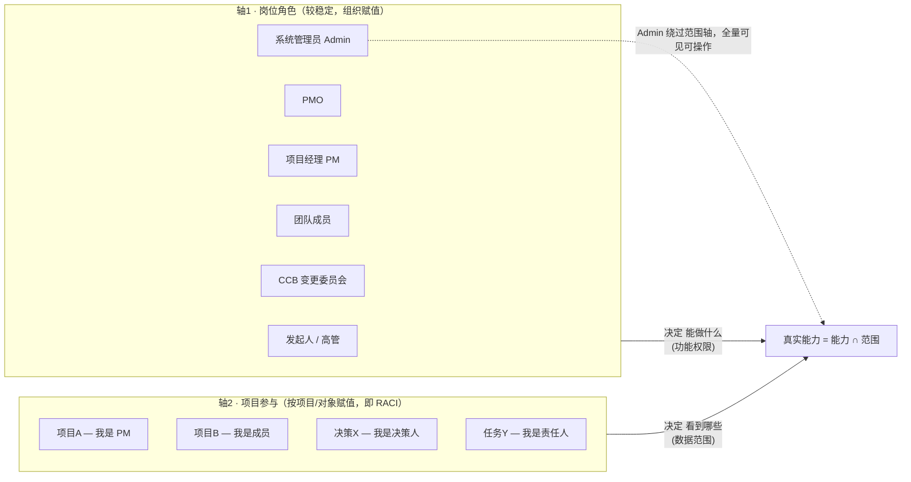

# 11 · 权责与访问范围设计

## 一、设计原则

1. **权限 × 范围 分离**（核心）：`岗位角色` 决定**能做什么功能**，`项目参与(RACI)` 决定**能看到/操作哪些数据**。两者相乘 = 真实能力。
2. **最小权限默认**：默认只看见"你是其责任人/决策人/知会人/被分配人"的对象 + 项目公开信息辐射源；PMO 与授权高管是治理例外。**系统管理员（Admin）是唯一的全权例外。**
3. **权责对齐 RACI**：每个关键流程明确 R(负责执行)/A(问责,唯一)/C(征询)/I(知会)，避免"谁都负责=没人负责"，**每活动 A 唯一**。
4. **固化动作有专属权责约束**：闭环确认、决策拍板、否决解除等"焊死"动作，权限绑定到特定角色，防止自审/越权。
5. **可审计**：所有权限敏感动作（审批、解除、配置、**管理员越权覆盖**）留痕。

## 二、双轴模型

**为什么这么拆**：「能确认闭环」是岗位能力，「但只能确认分配给你的任务」是范围。PM 能编辑 WBS，**仅限自己负责的项目**。Admin 是唯一不受范围轴约束的角色。

## 三、角色定义

| 角色 | 定位 | 核心权责 |
|------|------|---------|
| **系统管理员 Admin** | 系统级超级权限 | 拥有**全部功能权限与全部数据范围**，绕过范围轴，用于系统运维与异常处置；越权覆盖固化约束时记为 admin override 并审计（AC-ADMIN-01） |
| **发起人 Sponsor** | 资源提供者、最终问责人 | 批章程、批基线变更、go/no-go、对项目价值负责(A) |
| **高管 / 组合管理者** | 战略层 | 看组合健康、做投资排序决策 |
| **PMO** | 治理与标准 | 配模板/权重/SLA、全项目治理视图、度量 |
| **项目经理 PM** | 项目第一责任人 | 拆控推追回全程主导(R)，对项目成败负责 |
| **团队成员** | 执行单元 | 执行任务、报工时、上传交付物、确认闭环 |
| **决策人 Decider** | 动态角色 | 被指定时拍板，唯一担责(A) |
| **CCB 变更委员会（= 治理委员会或其授权上级）** | 变更治理 | 审批触及基线的变更 |
| **相关方 Stakeholder** | 利益相关 | 按授权查看信息辐射源，可被征询(C)/知会(I) |

> 功能经理（资源/质量/采购）作为跨项目支撑角色，对"人/资源"有跨项目可见性，但对"项目内容"无写权。

## 四、功能权限矩阵（岗位角色 × 关键动作）

✓ 可做 / ✗ 不可 / 条件标注。**管理员列恒为 ✓**（全权）。

| 动作 | 发起人 | 高管 | PMO | PM | 团队 | CCB | 相关方 | 管理员 |
|------|:---:|:---:|:---:|:---:|:---:|:---:|:---:|:---:|
| 立项/创建项目 | ✓ | ✓ | ✓ | 提议 | ✗ | ✗ | ✗ | ✓ |
| 治理配置（权重/SLA/模板） | ✗ | ✗ | ✓ | ✗ | ✗ | ✗ | ✗ | ✓ |
| 编辑 WBS/任务 | ✗ | ✗ | ✗ | ✓ | ✓(自己任务) | ✗ | ✗ | ✓ |
| 建立基线 | 审批 | ✗ | 监督 | 提议 | ✗ | ✗ | ✗ | ✓ |
| 提交变更申请 | ✓ | ✗ | ✗ | ✓ | ✓ | ✗ | ✗ | ✓ |
| 审批变更 | ✓(基线级) | ✗ | ✗ | ✗ | ✗ | ✓ | ✗ | ✓ |
| 登记风险/问题 | ✗ | ✗ | ✗ | ✓ | ✓ | ✗ | ✗ | ✓ |
| 创建决策 | ✓ | ✓ | ✓ | ✓ | ✓ | ✗ | ✗ | ✓ |
| 拍板决策 | ✓¹ | ✓¹ | ✓¹ | ✓¹ | ✓¹ | ✓¹ | ✗ | ✓ |
| 执行任务/报工时 | ✗ | ✗ | ✗ | ✓ | ✓ | ✗ | ✗ | ✓ |
| 确认任务闭环 | ✗ | ✗ | ✗ | ✓(非自提) | ✓(责任人) | ✗ | ✗ | ✓² |
| 填写复盘 | ✓ | ✗ | ✓ | ✓ | ✓ | ✗ | ✗ | ✓ |
| 评审/结项 | ✓ | ✗ | ✓ | ✓ | ✗ | ✗ | ✗ | ✓ |
| 解除健康否决 | ✓ | ✗ | ✗ | 推进 | ✗ | ✗ | ✗ | ✓² |
| 看本项目健康分 | ✓ | ✗ | ✓ | ✓ | 限本人相关 | ✗ | 授权可看 | ✓ |
| 看组合健康分 | ✓(自己组合) | ✓ | ✓ | ✗ | ✗ | ✗ | ✗ | ✓ |

¹ 拍板：任意角色**被指定为该决策的决策人时**方可，且唯一（AC-DM-03）。
² 管理员可越权覆盖固化约束，但记为 **admin override** 并审计（AC-ADMIN-01：双人确认或 24h PMO 复核，不静默）。

## 五、数据范围规则（不同人看不同范围）

| 角色 | 默认可见范围 |
|------|----------|
| **管理员 Admin** | **全部项目与全部对象（绕过范围轴）** |
| 发起人 | 自己发起/赞助的项目 + 相关组合聚合视图 |
| 高管 | 被授权的组合/部门范围（可全量，按组织授权） |
| PMO | 全部项目（治理只读 + 配置权） |
| PM | 自己负责的项目（全部对象） |
| 团队成员 | 分配给自己的任务 + 所属项目的公开信息辐射源 |
| 决策人 | 自己作为决策人的决策（跨项目，仅决策卡本身，关联对象按目标项目成员二次过滤） |
| 相关方 | 被授权查看的项目信息（只读，按辐射源配置） |
| CCB | 待审变更 + 相关项目上下文 |

**范围维度**（四维叠加过滤，Admin 不受此限）：项目成员关系 / 对象责任 / 组合·部门 / 状态(归档只读)。
**敏感字段分级**：成本、薪酬级工时按角色分级可见；Admin 可见全部。

## 六、关键流程 RACI 矩阵

R=负责执行 · A=问责(唯一) · C=征询 · I=知会。

| 流程 | R | A | C | I |
|------|---|---|---|---|
| 立项 | PM | 发起人 | PMO/相关方 | 团队 |
| 建立基线 | PM | 发起人 | 团队/CCB | 相关方 |
| 变更审批-基线级 | CCB(评审) | 发起人 | PM/团队 | 相关方 |
| 变更审批-非基线 | CCB | CCB主席 | PM/团队 | 相关方 |
| 风险应对(单风险) | 应对执行人 | 风险 owner | 团队 | PM |
| 风险应对(项目整体) | PM | PM | 团队 | 发起人 |
| 决策 | 提出人(常 PM) | 决策人 | 参与人 | 知会人 |
| 任务闭环 | 责任人(执行+提交) | PM(确认关闭) | — | 相关方 |
| 复盘 | PM | 发起人 | 团队/PMO | 相关方 |
| 结项 | PM | 发起人 | PMO | 相关方 |

> **任务闭环**：R=责任人执行并提交交付物，A=PM 确认关闭，**确认人 ≠ 提交人（禁自审，AC-DM-07b）**；单人项目走 AC-SOLO-01。
> **变更审批**：拆基线级(A=发起人)/非基线(A=CCB 主席)，消除双 A。
> **风险应对**：区分"单风险(A=风险 owner)"与"项目整体(A=PM)"。
> **A 绑自然人**：所有 A 字段绑定自然人+角色；CCB 主席轮值/风险 owner 交接时，在办对象的 A 自动重指派。

## 七、固化动作的权责约束（呼应反检验）

| 动作 | 权责约束 | 对应 AC |
|------|---------|--------|
| 确认任务闭环 | 须**非提交人**的 PM/验收人，禁自审 | AC-DM-07b / AC-TASK-02 |
| 拍板决策 | 须**唯一决策人**；达阈值决策人≠提出人 | AC-DM-03 / 01b |
| 解除健康否决 | 须**恢复方案责任人/发起人**推进可追踪行动项 | AC-X01(P0兜底) / AC-HS-06a(P1) |
| 审批变更 | MVP：**发起人**（FR-BASE-04）；P1：**CCB**（FR-CCB-01） | AC-BASE-03 |
| 配置权重/阈值/SLA | 须 **PMO** | AC-HS-22 |
| 撤销决策 | 须结构化理由；"已实际执行"非合法撤销 | AC-DM-07c |
| 高危风险关闭 | 须**发起人/PMO**确认（禁 PM 自开自关） | AC-RISK-03 |
| Admin 越权 | **双人确认或 24h PMO 复核**；禁 Admin 承担业务 R/A | AC-ADMIN-01 |

> 以上约束对**管理员不锁死**：Admin 可越过，但每次越过记为 admin override 并审计（AC-ADMIN-01）。

## 八、角色视图（不同人，不同首页）

| 角色 | 默认首页 |
|------|-------------------|
| 管理员 Admin | 系统运维台（全项目健康分总览、异常告警、admin override 审计流） |
| 高管 | 组合健康分仪表盘（红黄绿一屏 + 趋势） |
| PMO | 全项目治理看板（健康分排行、风险热力、决策债总值） |
| PM | 我的项目驾驶舱（健康分、待我推的决策、高危风险、逾期任务） |
| 团队成员 | 我的任务（待办、待确认闭环、待报工时） |
| 决策人 | 待我决策（决策卡队列 + 我的决策债） |
| 相关方 | 项目动态墙（里程碑、状态周报、与我相关的变更） |

## 九、多角色、委派与边界

- **系统管理员 Admin**：不受双轴范围限制，可操作全部项目与对象；任何越过固化约束的动作均记为 **admin override**——须**双人确认（Admin 发起+授权人）或 24h 内 PMO 复核**，解除否决/跳 CCB 类实时推 PMO（AC-ADMIN-01）。系统**禁止 Admin 承担业务 R/A**（不得作为某项目 PM/决策人），运维动作与业务动作分离。
- **单人/极小项目（AC-SOLO-01）**：有效成员 ≤1 或对象 A=R 同人时启用兜底——闭环改"责任人自报 + PMO/发起人 N 天内随机抽样审计"；决策允许"提出人=决策人"但强制抄送 PMO 并进高优审计队列。**角色冲突仲裁**：系统检测 A=R 同人时自动上抛一级确认。
- **一人多角色**：权限按「当前项目上下文 + 岗位角色」动态计算；切换项目即切换范围。
- **委派**：PM 可在项目内委派任务分配；发起人可委派审批，但**不得委派给变更申请人同项目 PM**（防经委派的自审），关键审批（基线级变更、go/no-go）禁止下委。
- **矩阵组织**：功能经理（资源/质量）对"人"有跨项目可见（做容量规划），但对"项目内容"无写权。
- **离场/转岗**：自动回收项目权限；归档项目全员转只读、冻结自动化与计债；原决策人失联（账号停用 N 天）自动放行发起人代确认换人。
- **越权提示**：动作超出当前范围时提示"需项目负责人/发起人授权"，而非静默失败。

---

> 本文档细化 PRD §6「权限：基于角色与 RACI」，并把反检验/审查中"防自审/防越权"的补丁落实到具体角色。
