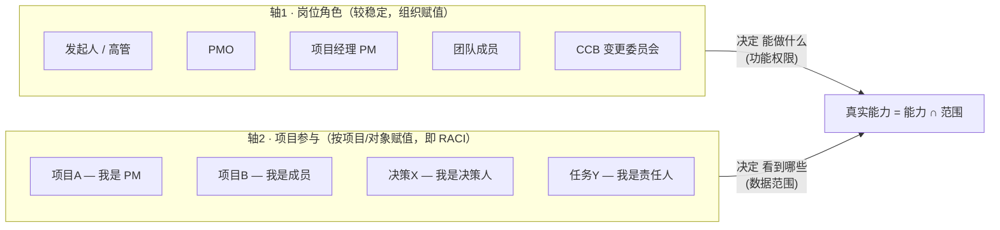

# 11 · 权责与访问范围设计

## 一、设计原则

1. **权限 × 范围 分离**（核心）：`岗位角色` 决定**能做什么功能**，`项目参与(RACI)` 决定**能看到/操作哪些数据**。两者相乘 = 真实能力。
2. **最小权限默认**：默认只看见"你是其责任人/决策人/知会人/被分配人"的对象 + 项目公开信息辐射源；PMO 与授权高管是治理例外。
3. **权责对齐 RACI**：每个关键流程明确 R(执行)/A(问责)/C(征询)/I(知会)，避免"谁都负责=没人负责"。
4. **固化动作有专属权责约束**：闭环确认、决策拍板、否决解除等"焊死"动作，权限绑定到特定角色，防止自审/越权（呼应 docs/09 反检验）。
5. **可审计**：所有权限敏感动作（审批、解除、配置）留痕。

## 二、双轴模型（最关键的一张图）

**为什么这么拆**：很多系统把"角色"和"范围"混成一团，导致"PM 能编辑 WBS"变成"PM 能编辑全公司的 WBS"。本设计里：
- 「能确认任务闭环」是岗位能力（团队成员/PM 都有）；
- 「但只能确认分配给你的任务」是范围（你是该任务责任人）。
- PM 能编辑 WBS，**仅限自己负责的项目**。

## 三、角色定义

| 角色 | 定位 | 核心权责 |
|------|------|---------|
| **发起人 Sponsor** | 资源提供者、最终问责人 | 批章程、批基线变更、go/no-go、对项目价值负责(A) |
| **高管 / 组合管理者** | 战略层 | 看组合健康、做投资排序决策 |
| **PMO** | 治理与标准 | 配模板/权重/SLA、全项目治理视图、度量 |
| **项目经理 PM** | 项目第一责任人 | 拆控推追回全程主导(R)，对项目成败负责 |
| **团队成员** | 执行单元 | 执行任务、报工时、上传交付物、确认闭环 |
| **决策人 Decider** | 动态角色 | 被指定时拍板，唯一担责(A) |
| **CCB 变更委员会** | 变更治理 | 审批触及基线的变更 |
| **相关方 Stakeholder** | 利益相关 | 按授权查看信息辐射源，可被征询(C)/知会(I) |

> 功能经理（资源/质量/采购）作为跨项目支撑角色，对"人/资源"有跨项目可见性，但对"项目内容"无写权。

## 四、功能权限矩阵（岗位角色 × 关键动作）

✓ 可做 / ✗ 不可 / 条件标注。

| 动作 | 发起人 | 高管 | PMO | PM | 团队 | CCB | 相关方 |
|------|:---:|:---:|:---:|:---:|:---:|:---:|:---:|
| 立项/创建项目 | ✓ | ✓ | ✓ | 提议 | ✗ | ✗ | ✗ |
| 治理配置（权重/SLA/模板） | ✗ | ✗ | ✓ | ✗ | ✗ | ✗ | ✗ |
| 编辑 WBS/任务 | ✗ | ✗ | ✗ | ✓ | ✓(自己任务) | ✗ | ✗ |
| 建立基线 | 审批 | ✗ | 监督 | 提议 | ✗ | ✗ | ✗ |
| 提交变更申请 | ✓ | ✗ | ✗ | ✓ | ✓ | ✗ | ✗ |
| 审批变更 | ✓(基线级) | ✗ | ✗ | ✗ | ✗ | ✓ | ✗ |
| 登记风险/问题 | ✗ | ✗ | ✗ | ✓ | ✓ | ✗ | ✗ |
| 创建决策 | ✓ | ✓ | ✓ | ✓ | ✓ | ✗ | ✗ |
| 拍板决策 | ✓¹ | ✓¹ | ✓¹ | ✓¹ | ✓¹ | ✓¹ | ✗ |
| 执行任务/报工时 | ✗ | ✗ | ✗ | ✓ | ✓ | ✗ | ✗ |
| 确认任务闭环 | ✗ | ✗ | ✗ | ✓(非自提) | ✓(责任人) | ✗ | ✗ |
| 填写复盘 | ✓ | ✗ | ✓ | ✓ | ✓ | ✗ | ✗ |
| 评审/结项 | ✓ | ✗ | ✓ | ✓ | ✗ | ✗ | ✗ |
| 解除健康否决 | ✓ | ✗ | ✗ | 推进 | ✗ | ✗ | ✗ |
| 看本项目健康分 | ✓ | ✗ | ✓ | ✓ | 限本人相关 | ✗ | 授权可看 |
| 看组合健康分 | ✓(自己组合) | ✓ | ✓ | ✗ | ✗ | ✗ | ✗ |

¹ 拍板：任意角色**被指定为该决策的决策人时**方可，且唯一（AC-DM-03）。

## 五、数据范围规则（不同人看不同范围）

| 角色 | 默认可见范围 |
|------|----------|
| 发起人 | 自己发起/赞助的项目 + 相关组合聚合视图 |
| 高管 | 被授权的组合/部门范围（可全量，按组织授权） |
| PMO | 全部项目（治理只读 + 配置权） |
| PM | 自己负责的项目（全部对象） |
| 团队成员 | 分配给自己的任务 + 所属项目的公开信息辐射源 |
| 决策人 | 自己作为决策人的决策（跨项目） |
| 相关方 | 被授权查看的项目信息（只读，按辐射源配置） |
| CCB | 待审变更 + 相关项目上下文 |

**范围维度**（四维叠加过滤）：
1. **项目成员关系**——是否该项目成员及角色
2. **对象责任**——是否某任务/风险/决策的责任人/决策人/知会人
3. **组合/部门**——所属业务线/组织单元
4. **状态**——已归档项目默认只读

**敏感字段分级**：成本、薪酬级工时等敏感数据按角色分级可见（如团队成员看不到项目总成本，PM/发起人可见）。

## 六、关键流程 RACI 矩阵

| 流程 | R 执行 | A 问责 | C 征询 | I 知会 |
|------|--------|--------|--------|--------|
| 立项 | PM | 发起人 | PMO/相关方 | 团队 |
| 建立基线 | PM | 发起人 | 团队/CCB | 相关方 |
| 变更审批 | CCB | 发起人(基线级) | PM/团队 | 相关方 |
| 风险应对 | 风险责任人 | PM | 团队 | 发起人 |
| 决策 | 提出人(常 PM) | 决策人 | 参与人 | 知会人 |
| 任务闭环 | 责任人 | PM | — | 相关方 |
| 复盘 | PM | 发起人 | 团队/PMO | 相关方 |
| 结项 | PM | 发起人 | PMO | 相关方 |

## 七、固化动作的权责约束（呼应反检验）

把"焊死"动作的权限绑死到特定角色，防自审/越权：

| 动作 | 权责约束 | 对应 AC |
|------|---------|--------|
| 确认任务闭环 | 须为**责任人/决策人**，**禁自审**（不能确认自己提的任务） | AC-DM-07b |
| 拍板决策 | 须为**唯一决策人**；影响达阈值时决策人 ≠ 提出人 | AC-DM-03 / AC-DM-01b |
| 解除健康否决 | 须由**恢复方案责任人/发起人**推进可追踪行动项，非自由文本 | AC-HS-06a |
| 审批变更 | 须 **CCB / 发起人**（基线级） | FR-CCB |
| 配置权重/阈值/SLA | 须 **PMO** | AC-HS-22 |
| 撤销决策 | 须记结构化理由；「已实际执行」非合法撤销理由 | AC-DM-07c |

## 八、角色视图（不同人，不同首页）

| 角色 | 默认首页（信息辐射源） |
|------|-------------------|
| 高管 | 组合健康分仪表盘（红黄绿一屏 + 趋势） |
| PMO | 全项目治理看板（健康分排行、风险热力、决策债总值） |
| PM | 我的项目驾驶舱（健康分、待我推的决策、高危风险、逾期任务） |
| 团队成员 | 我的任务（待办、待确认闭环、待报工时） |
| 决策人 | 待我决策（决策卡队列 + 我的决策债） |
| 相关方 | 项目动态墙（里程碑、状态周报、与我相关的变更） |

## 九、多角色、委派与边界

- **一人多角色**：权限按「当前项目上下文 + 岗位角色」动态计算；切换项目即切换范围。如某人在 A 项目是 PM、在 B 项目是成员。
- **委派**：PM 可在项目内委派任务分配；发起人可委派审批；委派留痕、可随时撤销。
- **矩阵组织**：功能经理（资源/质量）对"人"有跨项目可见（做容量规划），但对"项目内容"无写权。
- **离场/转岗**：自动回收项目权限；归档项目全员转只读。
- **越权提示**：当动作超出当前范围时，系统提示"需项目负责人/发起人授权"，而非静默失败。

---

> 本文档细化 PRD §6「权限：基于角色与 RACI」，并把 docs/09 反检验中"防自审/防越权"的补丁落实到具体角色。
