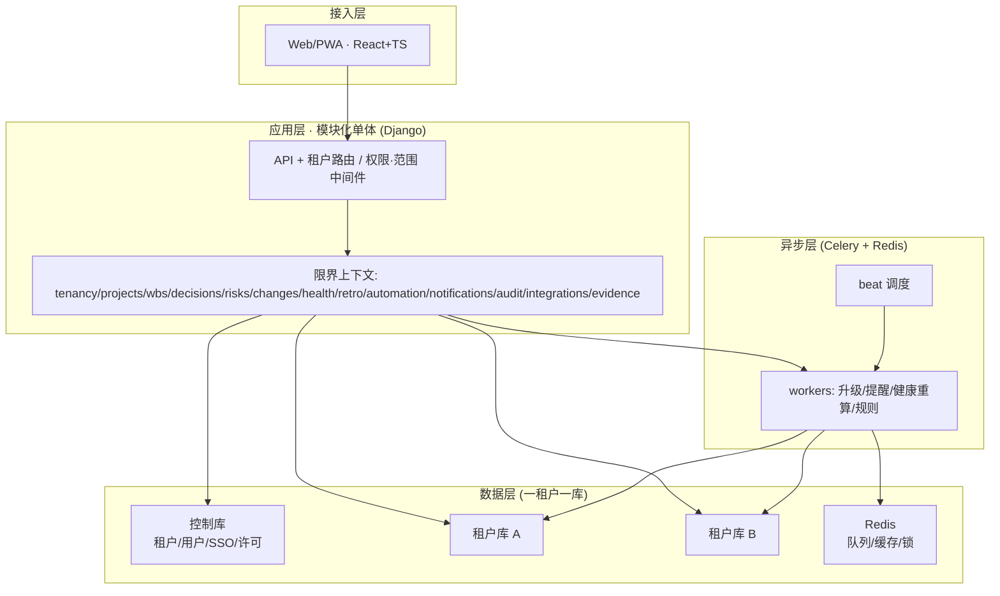

# 14 · 技术架构设计

> 业务设计的忠实技术落地。关键技术决策已拍板：**SaaS 多租户 · 一租户一库** + **Python(Django + Celery)** + **PostgreSQL** + **模块化单体(DDD)**。
> 本文件是技术设计的奠基；数据模型(docs/15)、API(docs/16)、部署运维(docs/17)、安全合规(docs/18) 为后续展开。

## 一、技术选型

| 层 | 选型 | 理由 |
|----|------|------|
| 后端 | **Python · Django + DRF** | 多库路由成熟（适配一租户一库）、ORM/迁移强、admin/合规友好、生态稳。 |
| 异步/定时 | **Celery + Redis**（broker/cache/分布式锁） | 决策升级/逾期提醒/健康重算/规则触发；beat 调度。 |
| 数据库 | **PostgreSQL（每租户一库）** | JSON/CTE/窗口函数(健康分/趋势)、行内加密、成熟运维。 |
| 缓存/锁 | Redis | 热点缓存、健康重算去抖锁、限流。 |
| 前端 | **React + TypeScript** | 角色驾驶舱、复杂表单(决策卡)；TanStack Query(服务端态) + Zustand(UI 态)。 |
| 移动 | **PWA（同前端）** | MVP 决策拍板/任务确认/审批关键路径；原生 App = P3。 |
| 状态机 | **django-fsm**（或 transitions） | 聚合状态迁移 + 守卫 + 非法迁移拒绝，直射 docs/07 六张状态机。 |
| 搜索 | PostgreSQL FTS（MVP）→ OpenSearch（P1） | 先用内建，规模上来再独立引擎。 |

> FastAPI 替代 Django 也成立（API/async 更现代），但多库路由/迁移/admin 弱一截；本设计以 Django 为准，骨架对 FastAPI 同样适用。

## 二、多租户策略：一租户一库（DB-per-tenant）

### 2.1 双层库结构
- **控制库（control/catalog DB，单一）**：`tenant`（租户、子域、状态、许可）、`user`（跨租户身份）、`tenant_user`（用户↔租户↔项目角色映射）、平台审计、计费。跨租户查询只在此层。
- **租户库（tenant DB，每租户一个）**：该租户全部业务数据（项目/决策/任务/风险/变更/健康/复盘/审计/证据）。

### 2.2 路由
- 请求中间件：从子域/JWT 解析 `tenant_id` → 查控制库得 DB 连接串 → 注入请求上下文；Django **db_router** 把业务模型路由到对应租户库，控制库模型走默认库。
- 连接池：每租户独立池（pgbouncer/池上限随租户增长调）；冷租户惰性连接。

### 2.3 迁移与运维
- 迁移脚本遍历全部租户库执行（`for t in tenants: migrate(t.db)`），CI/CD 内建此步；控制库单独迁移。
- 每租户独立备份/恢复/加密/留存（合规友好，金融政企路线受益）。
- **取舍**：强隔离、合规易、故障爆炸半径小；代价是租户数增长后运维与跨租户聚合成本上升。适合"中小数量租户、强合规要求"的定位。

## 三、架构风格：模块化单体（DDD 限界上下文）

一个 Django project，按限界上下文拆 app，边界清晰以便将来按上下文拆服务。

| 上下文（app） | 职责 | 对应业务模块 |
|------|------|------|
| `tenancy` | 租户、用户、SSO、RBAC + 数据范围、DB 路由 | docs/11 |
| `projects` | 项目、章程、生命周期、里程碑 | 立项/里程碑 |
| `wbs` | WBS、任务、交付物、任务状态机 | 拆/追 |
| `decisions` | 决策卡、决策状态机、升级、决策债 | docs/05 |
| `risks` | 风险、四策略、风险状态机 | docs/05/06 |
| `changes` | 变更、CCB、基线快照 | docs/05/06 |
| `health` | 健康分计算、否决、重算、趋势、迟滞 | docs/04 |
| `retro` | 复盘、经验库、资产评审 | 回 |
| `automation` | 规则引擎、升级/提醒调度（Celery） | 自动化 |
| `notifications` | 渠道、聚合、频次封顶、订阅 | docs/13 §三 |
| `audit` | append-only 事件日志（WORM 可选） | 治理 |
| `integrations` | IM/文档/代码/财务 adapter（P1+） | docs/13 §一 |
| `evidence` | 证据对象（横切，AC-X02） | docs/06 §0 |
| `shared_kernel` | 值对象、状态机基类、可追踪对象契约、工作日历 | — |

每个上下文：领域层（聚合/实体/值对象/领域事件）+ 应用服务（用例编排、权限校验）+ 基础设施（仓储/外部适配）+ 接口（API）。上下文间只通过**领域事件**与应用服务接口耦合，禁跨库 join。

## 四、核心领域模型与状态机

- **聚合根**：Project、WBS、Task、Decision、Risk、Change、BaselineSnapshot、HealthSnapshot、Retro、Milestone、Tenant、Evidence。
- **状态机**：用 django-fsm 给聚合加带守卫的迁移；非法迁移抛错（AC 校验"非法跳转拒绝"）。docs/07 六张状态机逐一映射：
  - 决策：`draft→pending→escalating→decided→executed→closed`，回退 `executed→pending`、代决 `escalating→closed`、撤销（AC-DM-05a/13b）。
  - 任务：`todo→doing→submitted→closed`，打回/重开/撤销。
  - 风险：按策略分叉（减轻→mitigating；接受→monitoring；转移→transferred→monitoring），`occurred→suspended`（双计 S4，问题闭环才终态）。
  - 变更：`requested→reviewing→approved→executed`，撤回。
  - 复盘：`pending→doing→asset_review→archived`，PMO 打回。
  - 项目：`initiating→planning→executing→closing→archived`，状态门（无基线不得 executing，AC-PRJ-02）、挂起评审。
- 每次迁移写 `audit` 事件 + 校验守卫（如闭环须交付物+非自审确认、决策截止≤里程碑、回退不重置时钟）。

## 五、关键技术挑战与方案

| 挑战 | 方案 | 对应 AC |
|------|------|--------|
| **基线不洗白** | `BaselineSnapshot` 聚合在建立基线时**冻结每个工作包的 PV**；CPI/SPI 一律对**原始基线**快照累计；重建只生成新快照喂给前瞻 EAC/ETC，不改历史指数。 | AC-BASE-02 |
| **健康分重算** | `health` Celery 任务：每日定时批量 + 领域事件即时触发带 **1h 去抖锁(Redis)**；存历史快照算趋势(≥3 周期滑动)与迟滞(恢复中·黄，AC-HS-07/07b)；否决按阶段启用表求值(AC-HS-06b)。 | AC-HS-04a/07/07b/06b |
| **并发竞态** | 聚合乐观锁（`version` 字段）：确认闭环/拍板/审批/状态迁移服务端原子检查 version + 状态，冲突重试/拒绝。 | AC-CONCUR-01 |
| **数值证据化** | `Evidence` 一等对象（挂基线快照/交付物/变更记录）；标量赋值（含首次定级）须挂≥1 证据 + 独立复核签收（高影响标量须结构化一致性判定）；来源标 human/system/**AI**，AI 内容须人工背书。 | AC-X02 |
| **可追踪对象强制** | 应用层守卫：方案/闭环/解除类动作必须产出带 owner+deadline 的行动项，否则服务层拒绝；交付物须过验收 checklist（AC-X01a）。 | AC-X01/X01a |
| **禁自审** | 服务层在确认/拍板时校验 `actor != submitter`（单人模式走抽样审计 SOLO-01）。 | AC-DM-07b/TASK-02 |
| **升级/自动化** | MVP：硬编码 Celery 任务（决策 50%提醒/到期升级/T2 代决、任务逾期、风险无应对、健康阈值动作）；领域事件触发 + beat 调度；计息时钟粘滞(AC-DM-13a)。P1：可配置规则引擎。 | AC-DM-13/13a/13b |
| **审计** | `audit` 事件 append-only（insert-only 表；合规版上 WORM）；每次状态迁移/权限敏感动作留痕；不可删，仅追加更正。 | 治理 |
| **权限×范围** | 租户隔离=物理（一租户一库，天然）；租户内 RBAC(角色→功能权限) × 数据范围(项目成员/RACI/对象责任)，仓储层强制注入范围过滤；SSO/SAML(OIDC)+SCIM。 | docs/11 |
| **通知** | `notifications` 服务：渠道适配器(站内/邮件/IM[P1])、聚合摘要、每人每日频次封顶、DND 窗口(按工作日历)、优先级分级；MVP 为服务，一等对象+双向执行=P1。 | docs/13 §三 |
| **集成** | `integrations` 端口+适配器，幂等键+重试+对账；P1 IM（决策卡↔IM 双向，MVP 站内+邮件降级兜底）；P2 文档/代码/财务(只拉凭证)。 | docs/13 §一 |

## 六、前端架构

- React + TS，按角色驾驶舱组织（docs/11 §八）：高管组合仪表盘、PMO 治理看板、PM 驾驶舱、团队任务、决策人队列、相关方动态墙、Admin 运维台。
- 服务端态 TanStack Query（含乐观更新：确认闭环/拍板/审批），UI 态 Zustand；表单 React Hook Form + zod 校验（直射决策卡/复盘结构化）。
- 状态机状态驱动 UI（按钮按可达迁移显隐，非法动作置灰）。
- PWA：MVP 决策拍板/任务确认/审批关键路径 + 离线只读 + 上线冲突合并。

## 七、非功能

| 类别 | 方案 |
|------|------|
| 可观测性 | OpenTelemetry 统一 trace/metrics；结构化日志带 tenant_id/project_id；每租户指标（健康分分布、决策债、采纳指标） |
| 安全 | OWASP；CSP/nonce；SSO(SAML/OIDC)；RBAC+范围；传输 TLS、静态加密、敏感字段(成本/薪酬)字段级加密；速率限制 |
| 合规 | 等保三级路径：append-only 审计、每租户独立备份、留存策略、RPO/RTO；GDPR/个保法主体权利（脱敏保留审计骨架） |
| CI/CD | 流水线含"遍历租户库迁移"步；蓝绿/滚动；特性开关（严格度/渐进强制） |
| 多库运维 | 新租户开库自动化、租户库健康检查、跨租户只读聚合(控制库 + 有限联邦查询) |
| 性能 | 健康分定时批量(非实时全量)、热点缓存、分页/索引、批量操作异步化 |

## 八、技术路线图（映射 docs/08）

- **MVP(P0)**：tenancy(含 DB 路由/SSO)、projects、wbs、tasks(状态机)、changes(轻)、risks、decisions(状态机+升级)、automation(硬编码)、retro、health(轻)、evidence、audit、notifications(服务)、PWA。+ 工作日历(默认组织)、最小状态报告。
- **P1**：EVM 完整+BaselineSnapshot、health(8 维+否决+趋势+迟滞)、决策债可视化、经验库跨项目、工时/资源、CCB、可配置规则引擎、OpenSearch 搜索、IM 集成。
- **P2**：组合/Program、相关方、报表/仪表盘、依赖增强、文档/代码/财务集成。
- **P3**：AI 副驾(RAG、人在回路、幻觉闸)、辅助轮模式、pre-mortem/风险剧本、跨组织对标、原生 App。

## 九、待定技术决策（不阻塞 MVP）

- AI 模型：外部 API vs 自托管（P3，依赖成本/隐私）。
- 任务队列：Celery+Redis → 规模化后是否上 RabbitMQ。
- 可观测性栈：OTel 后端选型（自部署 vs 云）。
- 前端：React（默认）vs Vue（若团队偏好）。

---

> 下一步：docs/15 数据模型（聚合 ER + 状态机字段 + 基线/证据/审计结构）、docs/16 API（REST + 状态迁移端点 + 事件）、docs/17 部署运维、docs/18 安全合规。
