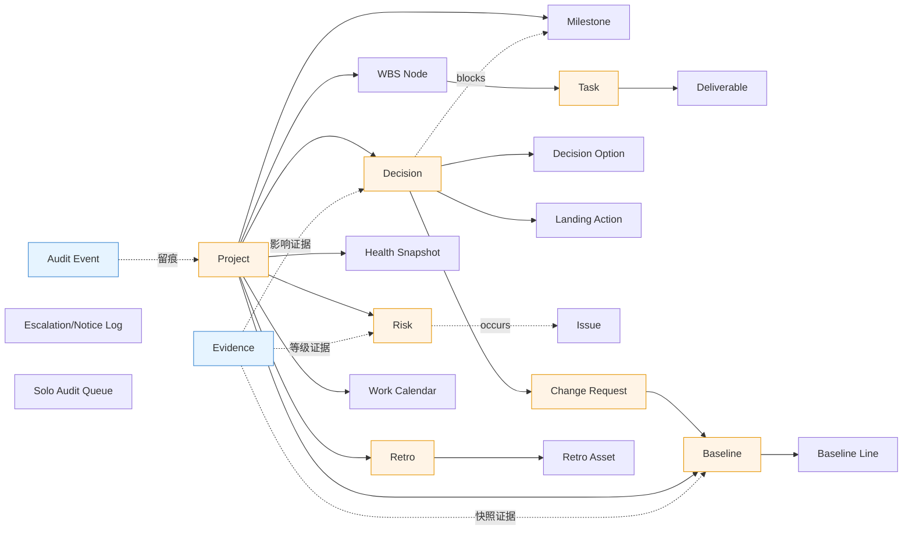

# 15 · 数据模型设计

> SQLAlchemy 2（async）模型。实现技术架构（docs/14）的核心数据结构。MVP 表详述，P1/P2 表概要。
> 核心命题：聚合边界清晰、状态机落 `status` 字段、**基线快照冻结 PV（AC-BASE-02）**、**Evidence 一等对象支撑数值证据化（AC-X02）**、**audit append-only**、一租户一库的外键边界。

## 一、设计原则与公约定

| 约定 | 规则 |
|------|------|
| 主键 | `id UUID`（优先 UUID v7，时间有序、索引友好）。SQLAlchemy `Mapped[uuid.UUID]`。 |
| 乐观锁 | 所有状态变更聚合带 `version INT`；服务端 `UPDATE ... WHERE id=? AND version=?`，冲突即拒（AC-CONCUR-01）。 |
| 状态机 | `status` 字段（枚举/check 约束）+ `transitions` 守卫；非法迁移应用层抛错。见 §六。 |
| 软删除 | 无物理删除（审计要求）；用状态（`cancelled`/`withdrawn`/`archived`）表达，删除走"撤销/归档"。 |
| 用户引用 | 跨库用户引用一律 `*_user_ref UUID`，**无外键约束**（用户在控制库），应用层校验存在性 + 经 `tenant_user` 映射。 |
| 时间 | `created_at/updated_at timestamptz`，存 UTC，展示按用户时区（docs/13 §8）。 |
| 变长结构 | `JSONB` 存可变结构（checklist、sub_scores、snapshot、impacts、holidays）。 |
| 金额/百分 | `numeric`，不用 float。 |
| 租户隔离 | 物理隔离（一租户一库），租户库表无 `tenant_id`（库即租户）；控制库表带 `tenant_id`。 |

## 二、库划分

### 控制库（control，单一）
| 表 | 职责 |
|----|------|
| `tenant` | 租户、子域、状态、许可、DB 连接串引用（secret ref，非明文） |
| `user` | 全局用户身份（email 唯一、SSO subject、状态） |
| `tenant_user` | 用户↔租户成员关系（MVP 项目角色默认） |
| `role_assignment` | RBAC × 范围：`scope_type`(org/project/object)·`scope_id`·`role` |
| `platform_audit` | 平台级动作（开租户、Admin override） |
| `subscription` | 计费/许可（轻） |

### 租户库（tenant，每租户一个）
见 §四。全部业务数据 + 业务审计。

## 三、核心聚合关系（概览）



> 根聚合（橙色）= 状态机/乐观锁载体；横切（蓝色）= Evidence/Audit 跨聚合关联。

## 四、租户库表清单（按限界上下文）

### 4.1 projects
**project**（聚合根）
| 列 | 类型 | 说明 |
|----|------|------|
| id | uuid | PK |
| code/name | text | 业务编码/名称 |
| status | enum | 状态机：initiating/planning/executing/closing/archived/suspended_review（图10） |
| mode | enum | predictive/adaptive/hybrid（立项锁定，切需审批，AC-HS-23） |
| sponsor_user_ref / pm_user_ref | uuid | 发起人/PM（→user，无FK） |
| parent_program_id | uuid? | 所属项目集（P2） |
| health_score / health_color / health_computed_at | numeric/enum/timestamptz | 缓存的健康分（权威在 health_snapshot） |
| baseline_present | bool | 是否已建基线（AC-BASE-01 执行前置） |
| is_solo | bool | 单人项目模式（AC-SOLO-01，立项选定） |
| strictness | enum | 渐进强制宽松度（docs/13 §6） |
| version | int | 乐观锁 |
| created_at/updated_at/created_by_user_ref | — | — |

**project_member**（项目成员 = 范围维度）
| 列 | 类型 | 说明 |
|----|------|------|
| id | uuid | PK |
| project_id | uuid FK→project | |
| tenant_user_id | uuid | →控制库 tenant_user（无FK） |
| project_role | enum | PM/member/sponsor/... |

**milestone**
| 列 | 类型 | 说明 |
|----|------|------|
| id | uuid PK | |
| project_id | uuid FK | |
| name/due_date/owner_user_ref | — | 名称/日期/责任人 |
| acceptance_criteria | text | |
| baseline_id | uuid FK→baseline | 归属基线 |
| status | enum | open/met/slipped |

### 4.2 wbs
**wbs_node**
| 列 | 类型 | 说明 |
|----|------|------|
| id | uuid PK | |
| project_id | uuid FK | |
| parent_id | uuid? self-ref | 父节点 |
| code/name/level | — | |
| is_work_package | bool | 叶子工作包 |
| deliverable_type / acceptance_criteria | — | 强制带（AC-WBS-01） |
| scope_hash | text | 范围指纹（WBS-01 diff 用） |
| version | int | |

**task**（聚合根，状态机图5）
| 列 | 类型 | 说明 |
|----|------|------|
| id | uuid PK | |
| project_id / wbs_node_id | uuid FK | |
| name/description | — | |
| status | enum | todo/doing/submitted/closed/cancelled |
| assignee_user_ref / submitter_user_ref | uuid | 执行人/提交人（**禁自审：acceptor≠submitter**，应用层校验） |
| deliverable_id | uuid FK→deliverable | 闭环前置 |
| accepted_at / accepted_by_user_ref | — | 闭环确认（非自审） |
| due_date / completed_pct + evidence_id | — | 完成%（须证据，AC-X02） |
| version | int | |

**deliverable**（AC-X01a 质量门）
| 列 | 类型 | 说明 |
|----|------|------|
| id | uuid PK | |
| task_id | uuid FK | |
| type/name | — | |
| content_hash | text | 防空文件/旧文档 |
| storage_ref | text | 对象存储引用 |
| acceptance_checklist | jsonb | 验收 checklist（逐条勾选） |
| checklist_signed_by / signed_at | — | 确认人（非自审） |

### 4.3 decisions
**decision**（聚合根，状态机图4）
| 列 | 类型 | 说明 |
|----|------|------|
| id | uuid PK | |
| project_id | uuid FK | |
| title/background | — | 决策导向标题 |
| status | enum | draft/pending/escalating/decided/executed/closed/withdrawn |
| impact_level | enum | low/med/high（**须证据 evidence_id**，AC-X02） |
| impact_evidence_id | uuid FK→evidence | |
| decider_user_ref | uuid | **唯一决策人** |
| submitter_user_ref | uuid | 提出人（达阈值 ≠ decider） |
| due_at | timestamptz | ≤ 所阻塞里程碑（AC-DM-12b） |
| linked_milestone_id | uuid FK→milestone | 阻塞关系（可自动探测 AC-DM-12a） |
| decided_at / decision_rationale | — | 已决记录 |
| is_solo | bool | 单人项目（允许同人，抄送 PMO） |
| debt_started_at | timestamptz | **计息时钟**（回退/改期不重置，AC-DM-05a/13a） |
| debt_frozen_at | timestamptz? | 落地停息 |
| version | int | |

**decision_option**（AC-DM-01a 互斥取向 / AC-DM-02）
| 列 | 类型 | 说明 |
|----|------|------|
| id | uuid PK | |
| decision_id | uuid FK | |
| seq | int | A/B... |
| description | — | |
| schedule_impact / cost_impact / scope_impact / quality_impact | jsonb | **结构化影响**（取向互斥校验） |
| pros/cons | — | |
| is_recommended / is_chosen | bool | |

**decision_landing_action**（AC-DM-07a N:1 绑定 / 07b 禁自审）
| 列 | 类型 | 说明 |
|----|------|------|
| id | uuid PK | |
| decision_id | uuid FK | 回链决策 |
| target_type | enum | change/risk/task/gate |
| target_id | uuid | 派生对象 |
| status | enum | pending/executed/closed/rejected |
| confirmed_by_user_ref | uuid | **≠ 提交人** |
| confirmed_at | — | |

**decision_stakeholder**：(decision_id, user_ref, raci_role[C/I])

### 4.4 risks
**risk**（聚合根，状态机图6，按策略分叉）
| 列 | 类型 | 说明 |
|----|------|------|
| id | uuid PK | |
| project_id | uuid FK | |
| title/description | — | |
| impact_level + evidence_id | — | 等级须证据（AC-X02） |
| probability | numeric | |
| response_strategy | enum | **avoid/transfer/mitigate/accept**（AC-RISK-02） |
| status | enum | identified/analyzed/mitigating/monitoring/transferred/occurred/suspended/closed/cancelled |
| owner_user_ref | uuid | 风险 owner（单风险 A） |
| residual_exposure | text | 减轻残留 |
| closed_by_user_ref / closed_at | — | **高危须发起人/PMO**（AC-RISK-03） |
| version | int | |

**issue**：`id, project_id, source_risk_id FK→risk, status, ...` —— 风险 occurred→suspended 重分类为问题，原风险记录保留、双计 S4 直至问题闭环。

### 4.5 changes
**change_request**（聚合根，状态机图7）
| 列 | 类型 | 说明 |
|----|------|------|
| id | uuid PK | |
| project_id | uuid FK | |
| type | enum | scope/schedule/cost/quality |
| reason | text | |
| status | enum | requested/reviewing/approved/rejected/executed/withdrawn |
| submitter_user_ref / approved_by_user_ref | uuid | 审批人（基线级=发起人；非基线=CCB 主席） |
| decision_id | uuid FK? | 由决策派生 |
| baseline_after_id | uuid FK→baseline | 重建后的基线 |
| version | int | |

**baseline**（聚合根，AC-BASE-02）—— 见 §七 深入
| 列 | 类型 | 说明 |
|----|------|------|
| id | uuid PK | |
| project_id | uuid FK | |
| name / snapshot_type | enum | initial/rebuild |
| parent_baseline_id | uuid? | **指向原始基线**（rebuild 链回原始） |
| status | enum | active/superseded |
| approved_by_user_ref / approved_at | — | 重建需发起人审批 |
| created_at | — | |

**baseline_line**（基线明细，冻结 PV + diff）
| 列 | 类型 | 说明 |
|----|------|------|
| id | uuid PK | |
| baseline_id | uuid FK | |
| wbs_node_id | uuid FK | |
| baseline_pv | numeric | **冻结的计划价值** |
| baseline_duration / baseline_scope_hash | — | 工期/范围指纹 |
| change_request_id | uuid? | WBS-01 diff 来源 |

### 4.6 health
**health_snapshot**（历史快照，趋势/迟滞）
| 列 | 类型 | 说明 |
|----|------|------|
| id | uuid PK | |
| project_id | uuid FK | |
| computed_at | timestamptz | |
| composite_score | numeric | |
| sub_scores | jsonb | {S1..S8} |
| veto_hits | jsonb | 命中否决 + 启用状态 |
| effective_dims | int | 有效维度数（灰判定，AC-HS-04a） |
| color | enum | green/yellow/red/grey |
| prev_color / is_recovering | — | **恢复中·黄**（AC-HS-07/07b） |
| trend | enum | up/stable/down（≥3 周期滑动） |
| weight_version | text | 当时权重版本（锁定） |

**health_weight_config**（AC-HS-23）
| 列 | 类型 | 说明 |
|----|------|------|
| id | uuid PK | |
| scope_type/scope_id | — | template/project |
| mode | enum | |
| weights | jsonb | {S1:20,...} 和=100 |
| locked_at | — | 项目级锁定不可中途改 |

**recovery_action**（AC-HS-06a/07b）
| 列 | 类型 | 说明 |
|----|------|------|
| id | uuid PK | |
| project_id / trigger_veto | — | |
| status | enum | pending/in_progress/closed |
| owner_user_ref / due_at | — | **可追踪行动项**（非文本） |
| closed_at | — | 全闭环才允许转绿 |

**ev_metric**（P1）：`id, project_id, period, ev, pv, ac, bac, cpi, spi, eac, vac, tcpi, vs_original_baseline bool`

### 4.7 retro
**retro**（聚合根，状态机图8）
| 列 | 类型 | 说明 |
|----|------|------|
| id | uuid PK | |
| project_id | uuid FK | |
| status | enum | pending/doing/asset_review/archived |
| reviews | jsonb | 六维（目标/范围/进度/成本/质量/满意度） |
| asset_review_due_at | timestamptz | **评审 SLA**（AC-RET-02） |
| version | int | |

**retro_asset**（AC-RET-02/04）
| 列 | 类型 | 说明 |
|----|------|------|
| id | uuid PK | |
| retro_id | uuid FK | |
| type | enum | template/checklist/rule/warning（结构化） |
| title/content/structured_ref | — | 可导入/可挂预警/可 attach |
| review_status | enum | pending/approved/rejected |
| reviewed_by / reviewed_at | — | PMO 抽审 |
| cited_count | int | 被引用次数排序（AC-RET-04） |

**knowledge_base_asset**（P1 跨项目）：`id, org-wide, source_project_id, from retro_asset, cited_count`

### 4.8 automation / notifications
**notification_log**
| 列 | 类型 | 说明 |
|----|------|------|
| id | uuid PK | |
| event_type / target_user_ref | — | |
| channel | enum | inapp/email/im |
| status | enum | queued/aggregated/sent/read |
| priority | enum | high/med/low |
| scheduled_at / sent_at | — | |
| dedupe_key | text | 幂等 + 聚合（AC-X01 可追踪） |
| content_ref / action_target | — | 双向执行（P1） |

**escalation_log**：决策/任务升级轨迹（含 T2 代决留痕）。
**rule**（P1 可配置规则引擎）、**solo_audit_queue**（AC-SOLO-01 抽样：`project_id, object_type, object_id, sampled_at, audited_by, result`）。

### 4.9 evidence（横切，AC-X02）
**evidence**
| 列 | 类型 | 说明 |
|----|------|------|
| id | uuid PK | |
| project_id | uuid FK | |
| kind | enum | baseline_snapshot/deliverable/change_record/external |
| target_type / target_id | — | 关联对象（risk/decision/task...） |
| target_field | text | 关联标量字段（risk.impact_level 等） |
| content_hash / storage_ref | — | 证据制品 |
| source | enum | **human/system/ai**（AI 不单独作证） |
| human_endorsed_by | uuid? | AI 内容须人工背书 |
| verified_by / verified_at | — | 独立复核签收 |
| consistency_check | jsonb | 高影响标量的"与证据一致性"结构化判定（AC-X02） |
| created_at / created_by_user_ref | — | |

> 数值证据化链路：`risk.impact_level` 变更 → 必挂一条 `evidence(target_type=risk, target_id, target_field=impact_level)` + `verified_by`（MVP 风险/影响等级强制）。应用层守卫：标量赋值（含首次）无对应 evidence → 拒绝。

### 4.10 audit（append-only）
**audit_event**
| 列 | 类型 | 说明 |
|----|------|------|
| id | uuid PK | |
| project_id | uuid? | |
| actor_user_ref | uuid | |
| action | text | create/update_state/approve/override/... |
| entity_type / entity_id | — | |
| before / after | jsonb | 状态迁移前后 |
| metadata | jsonb | （含 admin override 标记） |
| created_at | timestamptz | |

> **append-only 实现**：DB 层 revoke 该表的 UPDATE/DELETE 权限 + 触发器拦截（合规版上 WORM 归档）。只 INSERT。状态迁移服务在事务内同步写一条 audit_event。

### 4.11 shared_kernel
**work_calendar**：`id, scope(org/project/personal), scope_id, holidays jsonb, weekends`（SLA 按工作日算）。
**tenant_setting**：`id, settings jsonb`（严格度、频次封顶、DND 窗口）。

## 五、控制库补充表

**user**：`id, email(unique), display_name, sso_provider, sso_subject, status, created_at`
**tenant**：`id, name, subdomain(unique), status, db_dsn_ref(secret), license, created_at`
**tenant_user**：`id, tenant_id FK, user_id FK, default_role, status`
**role_assignment**：`id, tenant_user_id FK, scope_type, scope_id, role, granted_by, granted_at`
**platform_audit**：平台级动作（开租户、Admin override、SSO 事件）。

## 六、状态机字段 → transitions 映射

每个聚合根用 `transitions` Machine 绑 `status` + 守卫；`status` 字段就是当前态。示例（Decision）：

```python
# 决策聚合（伪码）
states = ["draft","pending","escalating","decided","executed","closed","withdrawn"]
transitions = [
  ["submit", "draft", "pending", guard=has_2_distinct_options_and_unique_decider],
  ["escalate", "pending", "escalating"],          # 到期（Celery 触发）
  ["decide", ["pending","escalating"], "decided", guard=unique_decider],
  ["execute", "decided", "executed", guard=has_landing_action],
  ["fallback", "executed", "pending"],            # AC-DM-05a 回退，不重置 debt_started_at
  ["trustee_close", "escalating", "closed", guard=steering_approved],  # AC-DM-13b 代决
  ["close", "executed", "closed", guard=landing_confirmed_and_not_self],
  ["withdraw", ["draft","pending","decided","executed"], "withdrawn", guard=structured_reason],
]
# 守卫触发审计（audit_event）；状态迁移 + version 乐观锁原子提交。
```

其余 5 张状态机（task/risk/change/retro/project）同理落 `status`，迁移规则见 docs/07 图5–10。

## 七、BaselineSnapshot 深入（AC-BASE-02 不洗白）

**核心**：CPI/SPI 一律对**原始基线**的冻结 PV 累计；重建基线只生成新 `baseline` + 新 `baseline_line`，**不回填历史指数**。
- 每个 `baseline_line` 冻结 `baseline_pv`（该工作包的计划价值）。
- EVM 计算：`PV = Σ baseline_line.baseline_pv(按进度日期)`，始终取**原始基线**（沿 `parent_baseline_id` 链回溯到 `snapshot_type=initial`）。
- 重建基线：新建 `baseline(snapshot_type=rebuild, parent_baseline_id=原始)`，其 `baseline_line` 用于**前瞻 EAC/ETC**（按新基线剩余工作预测），但 CPI/SPI 的分母仍是原始 PV。
- `baseline_diff`（WBS-01 自动检测）：建基线后 WBS 节点变更 → 系统 diff `scope_hash/baseline_pv` → 自动生成 change_request。
- 治理：`baseline` 重建次数 N≥2 → 触发治理评审、健康分当期封顶 79（AC-BASE-02）。

## 八、Evidence 与数值证据化（AC-X02）

- 进入健康分/否决/决策债的标量（`risk.impact_level`、`decision.impact_level`、`task.completed_pct`、冻结度/受控变更率）**任何赋值（含首次定级）** 须挂 ≥1 `evidence` + 独立复核 `verified_by`。
- 高影响标量额外要求 `consistency_check`（复核人填结构化判定）。
- 证据 `source` 标 human/system/**ai**；AI 生成内容须 `human_endorsed_by`，**不单独作证**。
- 应用层守卫 + 审计：等级变更触发历史回溯重算（重算健康分）。

## 九、Audit（append-only）

- 每次状态迁移 / 权限敏感动作（审批、解除、配置、Admin override）在**同一事务**内 INSERT 一条 `audit_event`（before/after JSONB）。
- DB revoke UPDATE/DELETE + 触发器拦截；合规版归档至 WORM。
- 不可物理删，仅追加"更正说明"记录。

## 十、索引与查询

| 查询 | 索引 |
|------|------|
| 决策队列（按 PM/决策人/状态/到期） | `(decider_user_ref, status, due_at)`、`(status) WHERE status IN (pending,escalating)` |
| 健康重算（批量项目） | `health_snapshot(project_id, computed_at desc)`、部分索引 `project(status WHERE status='executing')` |
| 范围过滤（项目成员可见任务） | `task(project_id, assignee_user_ref, status)` |
| 决策债统计 | `decision(status, debt_started_at) WHERE status=escalating` |
| 证据关联 | `evidence(target_type, target_id, target_field)` |
| 审计追溯 | `audit_event(entity_type, entity_id, created_at)` |

## 十一、迁移注意

- Alembic 迁移脚本遍历全部租户库执行（控制库 + 每个租户库）；CI/CD 内建此步；新租户开库自动建表 + seed 默认工作日历/模板。
- 枚举变更用可逆 Alembic op；JSONB 结构演进加版本字段。
- 多库一致性：跨库无 FK，用户/租户引用靠应用层校验 + 定期对账任务（Celery beat）。

---

> 下一步：docs/16 API 设计（FastAPI router + 状态迁移端点 + 领域事件 + 分页/批量/范围过滤依赖）、docs/17 部署运维、docs/18 安全合规。
