# 16 · API 设计

> FastAPI 实现。把 docs/11（权限×范围）、docs/06（AC 守卫）、docs/15（聚合/状态机/乐观锁/审计）落成可复用的 **Depends 依赖链 + 动作式端点**。MVP 端点详述。

## 一、设计原则

1. **REST + 动作式端点混合**：CRUD 用标准 REST（`GET/POST/PATCH`）；**状态迁移用动作端点** `POST /{resource}/{id}/{action}`（`decide`/`close`/`escalate`/`approve`…），语义清晰、直射状态机迁移。
2. **横切逻辑全是 Depends**：租户路由、认证、权限、数据范围、乐观锁、审计、证据/自审守卫——组合注入，handler 只写业务。
3. **守卫在应用层**：状态机迁移合法性、禁自审、必挂证据、可追踪对象——服务层守卫，失败抛领域错误（→统一错误模型）。
4. **一切状态变更同事务写 audit + 发领域事件**。
5. **版本化** `/v1`；OpenAPI 自动生成；幂等键保护创建/审批。

## 二、请求流水线（依赖链）

```mermaid
flowchart LR
  REQ[HTTP 请求] --> MW["TenantResolve 中间件<br/>子域/JWT→tenant_id→引擎+会话(contextvars)"]
  MW --> AUTH["Depends: CurrentUser<br/>JWT/SSO→user"]
  AUTH --> PERM["Depends: RequirePerm(action)"]
  PERM --> SCOPE["Depends: ScopeFilter<br/>校验对象在范围内 / 注入范围查询"]
  SCOPE --> LOCK["Depends: IfMatch(version)<br/>乐观锁"]
  LOCK --> H[Handler 服务层]
  H --> G1["transitions 守卫<br/>合法迁移?"]
  G1 --> G2["AC 守卫<br/>证据?自审?可追踪?"]
  G2 --> TXN[事务: UPDATE version+1<br/>+ INSERT audit_event<br/>+ 发布领域事件]
  TXN --> RESP["响应 + ETag(version)"]
  TXN -->|.delay.| CEL[Celery: 升级/通知/健康重算]
```



## 三、横切依赖详解

| 依赖 | 职责 | 失败 |
|------|------|------|
| `TenantResolve`（中间件） | 解析 tenant_id → 取/建引擎 → 请求级 `AsyncSession` 入 contextvars；控制库走默认 session | 404 unknown tenant |
| `CurrentUser` | 验 JWT/SSO → `user` + `tenant_user` + 角色集 | 401 |
| `RequirePerm(action)` | 校验角色对 `action` 有功能权限（docs/11 矩阵） | 403 forbidden |
| `ScopeFilter` | 详情：校验对象在用户数据范围内（项目成员/对象责任/决策人）；列表：注入范围 WHERE（4 维：成员/对象责任/组合/状态） | 403 out-of-scope |
| `IfMatch(version)` | `If-Match` 头取 version，UPDATE 时 `WHERE version=?`（AC-CONCUR-01） | 409 conflict |
| `Audit`（装饰器/中间件） | 包状态变更 handler，捕获 before/after，同事务 INSERT `audit_event` | — |
| `RequireEvidence` | 标量赋值（含首次）须挂 evidence + 独立复核（AC-X02） | 422 missing-evidence |
| `NotSelfReview` | 确认/拍板时 `actor != submitter`（AC-DM-07b/TASK-02；单人走 SOLO 抽样） | 422 self-review |

> Admin 角色在 `RequirePerm`/`ScopeFilter` 短路放行，但 `Audit` 仍记录（admin override 标记，AC-ADMIN-01）。

## 四、状态迁移端点总览（动作式）

迁移端点统一 `POST /v1/{resource}/{id}/{action}`，`If-Match: <version>`，响应返回新状态 + `ETag`。

| 资源 | 动作端点 | 迁移（docs/07） | 关键守卫 |
|------|---------|----------------|---------|
| decision | `/decisions/{id}/submit` | draft→pending | ≥2 互斥选项 + 唯一决策人 + due≤里程碑 |
| | `/decisions/{id}/decide` | pending/escalating→decided | 唯一决策人；选 option；记 rationale |
| | `/decisions/{id}/escalate` | pending→escalating | 到期触发（也可 Celery 自动） |
| | `/decisions/{id}/fallback` | executed→pending | 结构化理由；**不重置 debt_started_at** |
| | `/decisions/{id}/trustee-close` | escalating→closed | Steering 批准（AC-DM-13b） |
| | `/decisions/{id}/close` | executed→closed | 落地动作确认 + **非自审** |
| | `/decisions/{id}/withdraw` | *→withdrawn | 结构化理由；"已实际执行"非合法 |
| task | `/tasks/{id}/submit` | doing→submitted | 上传交付物（hash+checklist） |
| | `/tasks/{id}/close` | submitted→closed | 确认人**≠提交人** + checklist 勾选 |
| | `/tasks/{id}/reopen` | closed→doing | 限 N 天内 + 审计 |
| | `/tasks/{id}/cancel` | *→cancelled | — |
| risk | `/risks/{id}/respond` | analyzed→mitigating | 减轻措施 |
| | `/risks/{id}/monitor` | analyzed→monitoring | 接受策略 |
| | `/risks/{id}/transfer` | analyzed→transferred | 第三方/合同 |
| | `/risks/{id}/occur` | *→occurred→suspended | 重分类为 issue，双计 S4 |
| | `/risks/{id}/close` | *→closed | **高危须发起人/PMO** |
| change | `/changes/{id}/approve` | reviewing→approved | 基线级=发起人；非基线=CCB 主席 |
| | `/changes/{id}/reject` | reviewing→rejected | 触发决策回退 |
| | `/changes/{id}/execute` | approved→executed | 重建基线（喂前瞻 EAC） |
| project | `/projects/{id}/baseline` | planning→（建基线） | AC-BASE-01 |
| | `/projects/{id}/start-execution` | planning→executing | **无基线拒绝**（AC-PRJ-02） |
| | `/projects/{id}/close` | executing→closing | 触发复盘 |
| | `/projects/{id}/archive` | closing→archived | 冻结自动化/计债 |
| retro | `/retro/{id}/assets/{aid}/review` | asset_review→archived/rework | PMO 抽审（SLA） |

## 五、各模块端点清单（MVP）

### 5.1 projects / milestones
| 方法 | 路径 | 权限 | 说明 |
|------|------|------|------|
| POST | `/v1/projects` | project:create | 立项+章程 |
| GET | `/v1/projects` | — | 列表（范围过滤+健康灯筛选） |
| GET | `/v1/projects/{id}` | — | 详情（含健康摘要、里程碑） |
| PATCH | `/v1/projects/{id}` | project:edit | 改章程 |
| POST | `/v1/projects/{id}/baseline` | project:baseline | 建基线（冻结 PV） |
| POST | `/v1/projects/{id}/start-execution` | project:transition | 状态门（须有基线） |
| GET | `/v1/projects/{id}/health` | — | 当前健康分+下钻 |
| GET | `/v1/projects/{id}/health/history` | — | 趋势序列 |
| CRUD | `/v1/projects/{id}/milestones` | — | 里程碑（含 go/no-go） |

### 5.2 decisions
| 方法 | 路径 | 权限 | 说明 |
|------|------|------|------|
| POST | `/v1/decisions` | decision:create | 建卡（守卫见 §七示例） |
| GET | `/v1/decisions` | — | 队列（按决策人/状态/逾期/决策债） |
| GET | `/v1/decisions/{id}` | — | 详情（选项/留痕/债） |
| POST | `/v1/decisions/{id}/{action}` | decision:transition | decide/escalate/fallback/close/withdraw… |
| POST | `/v1/decisions/{id}/evidence` | decision:edit | 给标量挂证据（AC-X02） |
| POST | `/v1/decisions/{id}/landing-actions` | decision:edit | 建落地动作（回链决策） |
| POST | `/v1/decisions/{id}/landing-actions/{lid}/confirm` | decision:confirm | 确认落地（**非自审**） |

### 5.3 tasks / wbs
| 方法 | 路径 | 权限 | 说明 |
|------|------|------|------|
| CRUD | `/v1/projects/{id}/wbs` | wbs:edit | WBS（建基线后 diff 自动生成 change） |
| POST | `/v1/tasks` | task:create | 强制交付物/责任人/截止/验收 |
| GET | `/v1/tasks` | — | 我的任务/筛选/排序 |
| POST | `/v1/tasks/{id}/{action}` | task:transition | submit/close/reopen/cancel |
| POST | `/v1/tasks/{id}/progress` | task:edit | 更新完成%（须证据） |

### 5.4 risks / changes / health / retro
| 方法 | 路径 | 权限 | 说明 |
|------|------|------|------|
| CRUD+action | `/v1/risks`, `/v1/risks/{id}/{action}` | risk:* | 四策略分叉 + 高危关闭独立确认 |
| POST | `/v1/changes` | change:create | 变更申请（或 WBS diff 自动） |
| action | `/v1/changes/{id}/{action}` | change:approve/execute | approve/reject/execute |
| POST | `/v1/baselines/{id}/rebuild` | baseline:rebuild | 重建（发起人审批 + N≥2 封顶） |
| GET | `/v1/projects/{id}/health` | — | 见 5.1 |
| POST | `/v1/projects/{id}/health/recover` | health:recover | 提交恢复行动项（可追踪，AC-HS-06a） |
| POST | `/v1/projects/{id}/retro` | retro:start | 启动复盘 |
| POST | `/v1/retro/{id}/assets` | retro:edit | 加结构化资产 |
| POST | `/v1/retro/{id}/archive` | retro:archive | 结项（须资产入库） |

### 5.5 tenancy / auth / me
| 方法 | 路径 | 权限 | 说明 |
|------|------|------|------|
| POST | `/v1/auth/login` · `/v1/auth/sso/callback` | — | 登录/SSO(OIDC/SAML) |
| GET | `/v1/me` | — | 当前用户+角色+范围 |
| GET | `/v1/me/notifications` | — | 通知中心（聚合/已读） |
| POST | `/v1/admin/*` | admin:* | 运维（override 留痕） |

## 六、分页 / 筛选 / 排序 / 批量

- **游标分页**：`?cursor=&limit=`（避免大偏移）；列表默认按相关度/紧急度。
- **筛选**：`?pm=&decider=&color=&overdue=&project_id=`（直射 docs/11 范围维度）。
- **排序**：`?sort=debt,desc` / `priority` / `impact`。
- **批量**：`POST /v1/tasks/bulk` `{ids[], action}`（改派/关闭/归档），单事务逐个走状态机守卫，部分失败返回逐条结果。
- **导出**：`GET /v1/projects/{id}/status-report?format=pdf|csv`（MVP 最小状态报告）。

## 七、请求/响应模型（Pydantic 示例）

```python
# 决策卡创建（直射 AC-DM-01/01a/01b/02/12b）
class DecisionOptionIn(BaseModel):
    seq: int  # A/B...
    description: str
    schedule_impact: timedelta | None
    cost_impact: Decimal | None
    scope_impact: str | None
    quality_impact: str | None
    pros: str | None
    cons: str | None
    is_recommended: bool = False


class DecisionCreate(BaseModel):
    title: str  # 决策导向
    background: str
    options: list[DecisionOptionIn]  # >=2, 取向互斥(守卫)
    decider_user_ref: UUID  # 唯一；达阈值 != submitter
    due_at: datetime  # >= now 且 <= linked_milestone.due (守卫)
    impact_level: Literal["low", "med", "high"]
    impact_evidence_id: UUID  # 首次定级即须证据 (AC-X02)
    linked_milestone_id: UUID | None
    participants: list[UUID] = []  # C
    informed: list[UUID] = []  # I
    # 服务层守卫: options>=2 & 互斥 & decider!=submitter(阈值) & due<=milestone
```

响应统一含 `id, status, version`（`ETag`），迁移端点返回 `{action, from, to, at, by}`。

## 八、领域事件与异步触发

状态迁移在事务内 `publish` 领域事件到进程内总线，提交后分发：
- `DecisionOverdue` / `DecisionEscalating` → Celery `escalate_task.delay`（升级 + T2 `countdown` 代决）+ 通知。
- `DecisionDecided` → 派生落地动作 + 通知知会人 + 健康重算（带 1h 去抖）。
- `TaskClosed` / `RiskClosed` / `ChangeExecuted` → 健康重算 + 审计。
- `VetoHit` / `ColorChanged(green→yellow)` → 触发状态转换动作（24h 纠偏提醒，AC-HS-18a）。

> 健康重算：事件即时 + Celery beat 每日批量，均带 Redis 1h 去抖锁（AC-HS-07b 周期=日）。

## 九、幂等与速率限制

- **幂等**：创建/审批类支持 `Idempotency-Key` 头，键→响应缓存 24h（Redis），重复键返回原结果（防重复拍板/确认）。
- **限流**：per-tenant + per-user，Redis 计数（如 slowapi）；写操作更严，防自动化滥用。

## 十、错误模型与状态码

统一信封 `{error: {code, message, details}}`：
| HTTP | code | 场景 |
|-----|------|------|
| 401 | unauthenticated | 未登录/SSO 失败 |
| 403 | forbidden / out_of_scope | 无功能权限 / 超数据范围 |
| 404 | not_found / unknown_tenant | — |
| 409 | conflict | 乐观锁版本冲突（AC-CONCUR-01） |
| 422 | illegal_transition | 状态机非法迁移（docs/07） |
| 422 | self_review | 确认人=提交人 |
| 422 | missing_evidence | 标量未挂证据/未复核（AC-X02） |
| 422 | not_trackable | 提交/解除未产出可追踪对象（AC-X01） |
| 422 | baseline_required | 无基线进执行（AC-BASE-01） |
| 422 | options_not_distinct | 决策选项取向不互斥（AC-DM-01a） |
| 422 | due_after_milestone | 决策截止晚于阻塞里程碑（AC-DM-12b） |

## 十一、OpenAPI / 文档 / 版本化

- FastAPI 自动生成 `/openapi.json` + `/docs`（Swagger）/ `/redoc`；Pydantic 模型即契约。
- 路径前缀 `/v1`；破坏性变更升 `/v2`，旧版维护期。
- 契约测试：基于 OpenAPI 生成用例（含状态机非法迁移、守卫失败用例）。

## 十二、安全

- **CORS**：白名单前端域；**CSP** nonce 脚本；cookie 认证开 **CSRF**（SameSite + token）。
- 传输 TLS；敏感字段（成本/薪酬）API 响应按角色脱敏（docs/11 分级）。
- 审计端点 `GET /v1/admin/audit-events` 仅 PMO/Admin，支持按实体/动作/时间检索。

---

> 下一步：docs/17 部署运维（多租户库自动化/Celery/可观测性/CI/CD/备份）、docs/18 安全合规（等保/GDPR/加密/审计留存）。
