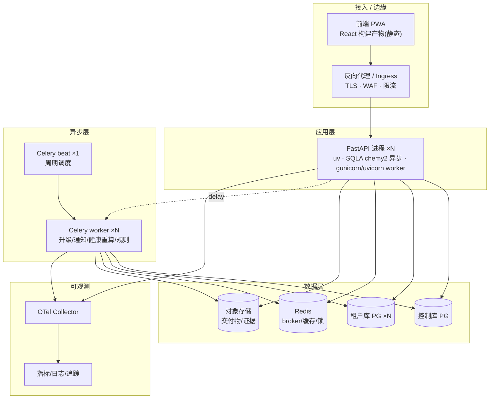

# 17 · 部署运维

> FastAPI（uv）+ Celery + PostgreSQL(一租户一库) + Redis 的部署、多租户库自动化、CI/CD、可观测性、备份灾备。模块化单体形态，边界清晰便于将来按上下文拆服务。

## 一、部署拓扑



- **进程模型**：FastAPI（gunicorn 多 uvicorn worker，异步）；Celery worker 独立进程；beat 单实例（K8s 用 Leader Election 或单 Pod 防重复调度）。
- **形态**：Docker + K8s（推荐）或 Compose（小规模）；模块化单体镜像，环境变量区分 app/worker/beat 入口。
- **前端**：构建静态产物，CDN/Ingress 托管，PWA。

## 二、多租户库自动化

| 操作 | 流程 |
|------|------|
| **开租户** | 控制库记 `tenant` → 自动建租户库（DDL 模板）→ Alembic 升到 head → seed 默认工作日历/行业模板/示范项目 → 连接串以 secret ref 入库 → 引擎注册表预热 |
| **迁移** | Alembic 脚本遍历全部租户库 + 控制库执行；CI/CD 内建；失败按租户回滚并告警，不阻塞其他租户 |
| **归档/下线** | 租户库转只读 → 备份 → 加密归档（合规留存）→ 释放连接池 |
| **连接池** | 每租户 `AsyncEngine` 惰性建、空闲回收；活跃租户多时按 LRU 驱逐会话、按需重建；池大小随租户规模分级 |
| **规模化** | 租户库可按 DB 集群/实例分组（hash 分桶），单实例承载有限租户；控制库联邦查询做组合聚合 |

## 三、Celery 部署

- **队列分流**：`escalation`（高优，升级/T2 代决）、`health`（批量重算）、`notification`、`default`；worker 按 `-Q` 绑定，防低优任务饿死升级。
- **T2 代决**：`escalate_task.apply_async(countdown=T2)`；任务幂等（查状态再动）；worker 崩溃后 beat 兜底扫描"升级中超时"。
- **可靠性**：任务幂等键 + 重试（指数退避）+ 死信队列人工介入；`acks_late=True` 防重复执行。
- **并发**：prefetch 按 任务类型调（IO 密集 → 高并发；DB 重算 → 限并发防库压）。

## 四、配置与密钥

- 配置走环境变量 + 配置中心；**密钥**（DB DSN、SSO client secret、KMS key、对象存储凭证）走 Secrets Manager / K8s Secret，**不入镜像/代码**。
- 每租户 DB DSN 为 secret ref，运行时解析。
- 配置变更审计（platform_audit）。

## 五、CI/CD

```
lint → uv sync → pytest(单测+状态机非法迁移+守卫失败用例) → 构建 Docker
→ 迁移(控制库 + 遍历租户库 Alembic) → 蓝绿/滚动发布(app/worker)
→ 冒烟(健康分计算/决策升级/闭环 e2e) → 切流
```
- **迁移先行**：向后兼容迁移（扩字段先加、旧代码仍跑）；破坏性迁移分两次发布（兼容期 → 清理）。
- **回滚**：镜像即时回滚；DB 迁移提供 down 脚本，破坏性变更不可逆时走"前向修复"。
- **特性开关**：严格度（宽松/标准/严格）、渐进强制、新模块按租户灰度。

## 六、可观测性

| 维度 | 方案 |
|------|------|
| 追踪 | OpenTelemetry，span 带 `tenant_id`/`project_id`/`user_ref`；跨 app↔worker 传递 trace |
| 指标 | Prometheus：请求量/延迟/错误率、Celery 队列深度/失败率、健康重算耗时、决策升级延迟、DB 连接池 |
| 日志 | 结构化 JSON，带 tenant/project 上下文；审计日志独立流 |
| 告警 | 升级队列堆积、健康重算失败率、否决风暴（短时大量红）、T2 代决积压、租户库迁移失败、磁盘/连接水位 |
| 每租户视图 | 按 tenant 维度的健康分分布、决策债总值、采纳指标（绕过率/撤销率/敷衍率）仪表盘 |

## 七、备份与灾备

| 项 | 方案 |
|----|------|
| 租户库 | 每库独立物理备份 + PITR（时间点恢复）；**RPO≤15min、RTO≤4h**（可按租户 SLA 分级） |
| 控制库 | 高频备份 + 异地；丢失=全租户映射受损，最高优先级 |
| Redis | AOF/RDB；仅作缓存/broker，可重建，不强求零丢失（决策升级状态以 DB 为准，Redis 丢则 beat 兜底） |
| 对象存储 | 版本化 + 跨区复制（交付物/证据不可丢） |
| 演练 | 季度恢复演练（随机租户库恢复到隔离环境验证） |
| 多区 | 控制库 + 热点租户库跨可用区/异地热备；按合规要求决定是否跨境 |

## 八、运维 Runbook（关键场景）

| 场景 | 处置 |
|------|------|
| 新租户开库失败 | 控制库标记 `provisioning_failed`，重试脚本幂等续跑；不暴露半成品库 |
| 租户库迁移失败 | 单租户回滚，其余继续；失败库置维护态、告警 DBA |
| 决策升级风暴 | `escalation` 队列扩 worker；通知聚合降流量；排查根因（SLA 配置/工作日历缺失） |
| 决策卡在 escalating | beat 扫描 + T2 代决；Steering 终点兜底 |
| 健康分异常波动 | 检查去抖锁、原始基线 PV、数据源集成掉线（显"数据暂缺"不转灰抖动） |
| 租户库连接耗尽 | 引擎池扩容 + 限流该租户 + 排查慢查询 |

## 九、特性开关与灰度

- 严格度开关（渐进强制）、新模块（如 EVM/决策债）按租户灰度；开关变更入 platform_audit。
- MVP 硬编码规则 → P1 可配置规则引擎，开关切换。

---

> 配套：docs/18 安全合规（等保/GDPR/加密/审计留存/SSO-SCIM/Admin 治理）。
